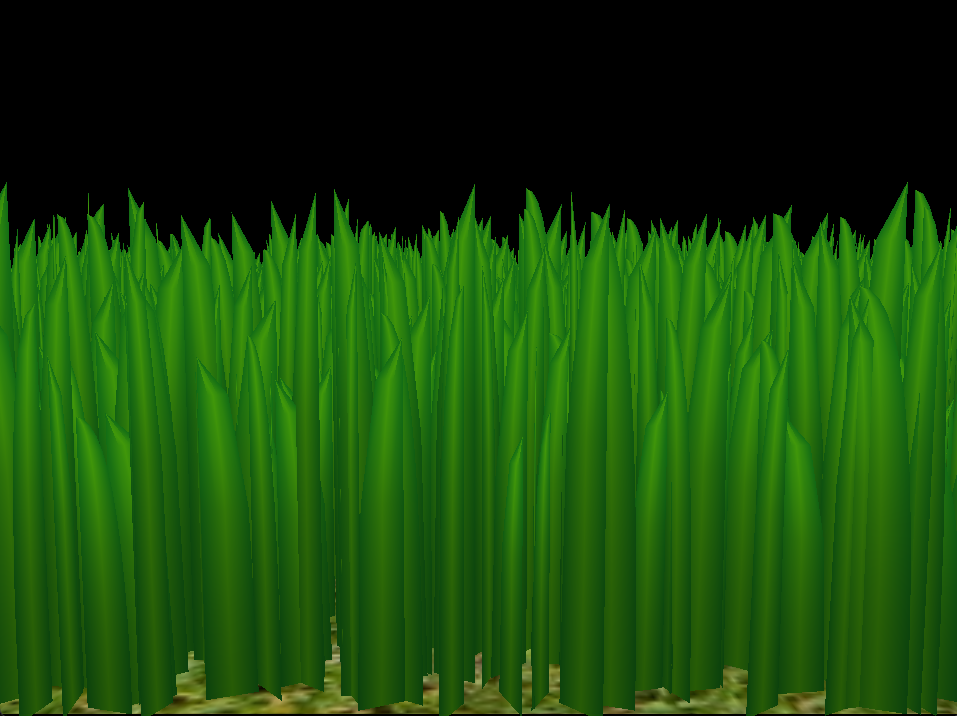
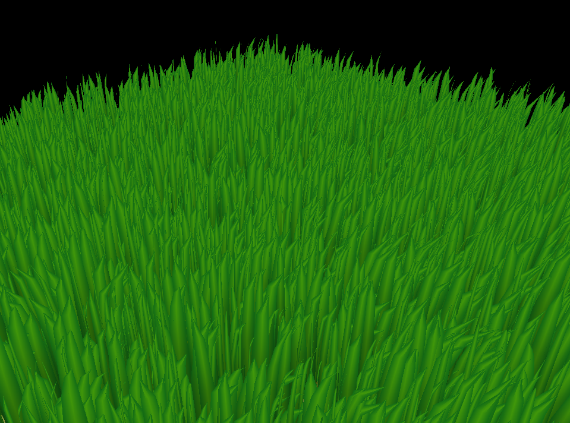
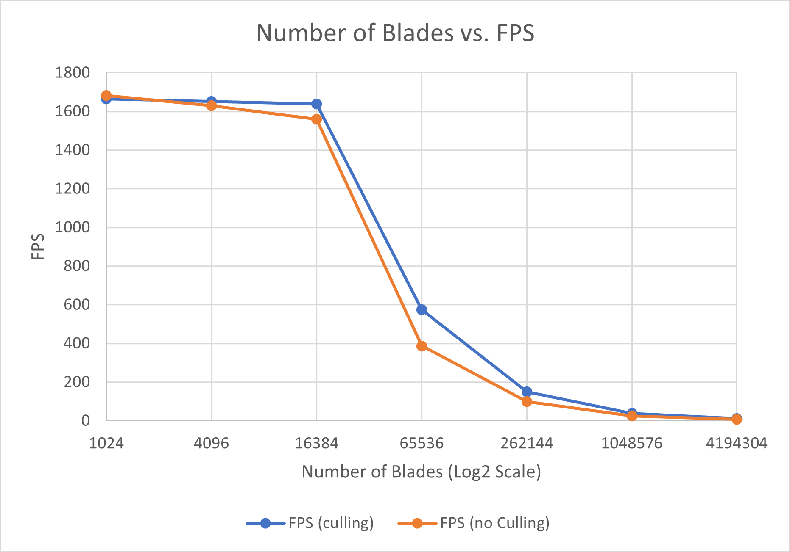
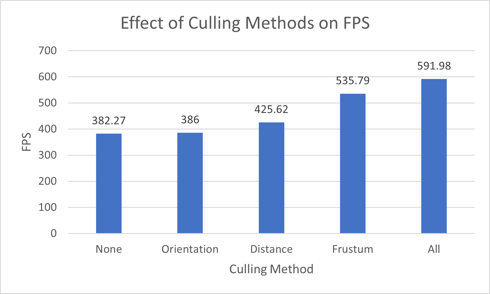

Vulkan Grass Rendering
==================================

**University of Pennsylvania, CIS 565: GPU Programming and Architecture, Project 5**

* Alan Qiao
* Tested on: Windows 11 22H2, Intel Xeon W-2145 @ 3.70GHz 64GB, RTX 3070 8GB (Dorm Workstation)

## Introduction

This project implements a grass simulation using Vulkan, based on the paper "[Responsive Real-time Grass Rendering for General 3D Scenes](https://www.cg.tuwien.ac.at/research/publications/2017/JAHRMANN-2017-RRTG/JAHRMANN-2017-RRTG-draft.pdf)". This project follows the Vulkan graphics pipeline employing in order the following shaders:

Vertex → Tessellation Control → Tessellation Evaluation → Compute → Fragment

Each grass blade is modeled as a bezier curve tesselated into a grass shape. Using compute shaders, basic physics simulation of the impact of gravity and a varying wind field are applied.

## Features
### Tessellation and Rendering
Each Grass blade is modeled by three control points, width and height of blade, an up vector for vertical direction, and an angle for blade orientation. The following diagram, sourced from the reference paper, provides a clear illustration of this setup.

This quadratic bezier curve model is memory efficient, but requires tesselation to procedurally generate renderable spline geometry.

The basic shape that would be transformed according to the bezier curve in this implementation is a quadratic. This provided a nice basis for creating a grass blade that converges at the tip. 

### Physics Simulation
In this implementation, three forces are considered: gravity, "recovery force", and wind. Gravity is implemented as a constant downwards vector applied to the tip of the grass blade. The "recovery force" represents the resistance against deformation from gravity, and is proportional to the degree of deformation (measured by distance from upright position) multipled by a stiffness coefficient. Lastly, wind is modeled as a two dimensional force field that is simulated using Perlin noise, and is sampled at the each blade's position to determine direction and strength of wind, as well as how it would interact with the blade given its orientation and deformation.

### Culling

To increase performance in larger scenes, blades are culled by three heuristic tests.
1. Orientation Test  
If the blade is approximately parallel to the camera's view direction, it would be culled since the blades aren't modeled with thickness and thus would not be visible from the side.
2. View Frustrum Test  
if the blade lies outside the view frustum, it would be culled because it would not be visible in the final render either way.
3. Distance Test  
Since objects further away are smaller, further objects take up less space on the screen and thus may need less detail to look convincing. Thus, decreasing number of blades are actually rendered the further away from the camera.

## Performance Analysis
For consistency, a single camera angle (see below) was chosen for all performance renders. The angle was chosen such that all three of the culling techniques could be in effect to some extent.

### Number of Blades

As expected, performance decreases with the number of blends to render. Up until $2^{12}$ blades, there isn't a clear advantage for culling. This is likely because the rendering task is sufficiently light that the additional process time of culling have greater impact. As the number of blades increases beyond that threshold, the performance improve boemces signifcant, with the no culling implementation consistently performing below the culling implementation. The benefit of culling, however, is difficult to quantify over all possible configurations as these culling heuristics may not be triggered at certain camera configurations.

### Culling

This chart was computed using the same camera angle specificed at the top of this section with $2^{16}$ grass blades. It is clear that all culling methods make contributions reducing the computation load, but to a different degree depending on the camera setup. 

The impact of orientation culling is the least, and this may perhaps be a result of my wind function exhibiting rather random winds that change directions often, making the chance of a blade being parallel to the camera's view very low.  
The distance contribution is more significant but also limited. This may be caused by the scene plane covering only a 15 by 15 space, which is smaller than the specified maximum culling distance. As a result, the number of blades that would be culled at the visible distances would be relatively few.  
The frustum culling method made the most significant contribution, and this is expected because the chosen angle omits grass from three of the four corners of the plane for a extended range. As a result, there is a significant number of blades that don't need to be rendered, hence the major improvement.  
Finally, the impact of combining all culling methods is provided as a top reference.