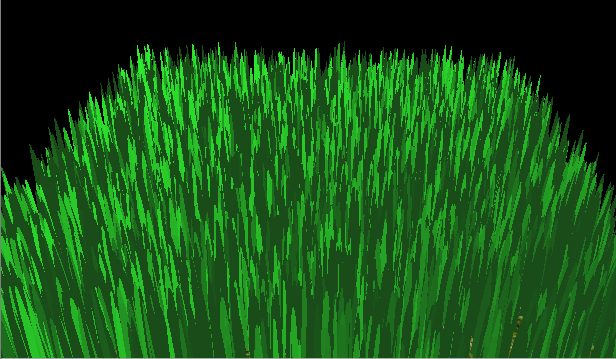
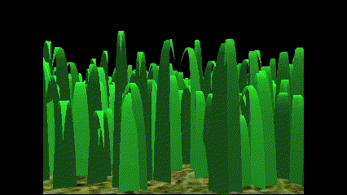
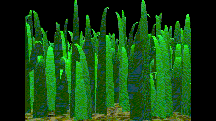
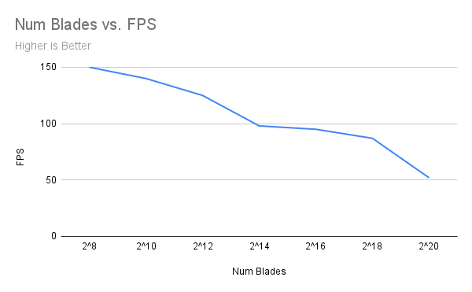
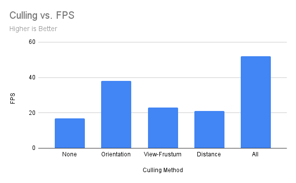

Vulkan Grass Rendering
==================================

**University of Pennsylvania, CIS 565: GPU Programming and Architecture, Project 5**

* Xinyu Niu
* [Personal website](https://xinyuniu6.wixsite.com/my-site-1)
* Tested on: Windows 11, i9-13980HX @ 2.20GHz 16GB, RTX 4070 16185MB (Personal)

## Introduction
This project is about using Vulkan to implement a grass simulator and renderer. The application uses compute shaders to perform physics calculations on Bezier curves that present individual grass blades.To increase efficiency of the rendering process, the application also uses compute shader to cull grass blades that don't contribute to a given frame. Then the remaining blades will be passed to a graphics pipeline, where a vertex shader will transform Bezier control points, tessellation shaders will dynamically create the grass geometry from the Bezier curves, and a fragment shader will shade the grass blades. The grass rendering algorithm is implemented based on the paper ["Responsive Real-Time Grass Rendering for General 3D Scenes"](https://www.cg.tuwien.ac.at/research/publications/2017/JAHRMANN-2017-RRTG/JAHRMANN-2017-RRTG-draft.pdf).


## Features
The implementation includes influence of different forces on grass blades, which are ```Gravity```, ```Recovery```, and ```Wind```.

| None | Gravity | Gravity + Recovery | Gravity + Recovery + Wind |
|---|---|---|---|
|||||

Another part of the main implementation is about different methods to do culling on grass blades with small contribution to the scenes, which are ```Orientation Culling```, ```View-Frustum Culling```, and ```Distance Culling```. 

| Orientation Culling | View-Frustum Culling | Distance Culling |
|---|---|---|
||||

## Performance Analysis

As number of blades increase, we can observe significant 
decrease of average FPS, which is expected as increasing number of blades simply increases works to be done by each steps.



For different culling method, I tested the average FPS for each of them when number of blades equals to 2^20. We can observe that among all three methods, orientation culling works the best and the other two have only small influence on the performance. The reason behind this might be that at most of the time, all blades are in the view frustum and are not too distant from the camera, while with camera rotating and force on blades, many blades might meet the condition of being ignore by the orientation culling test.

