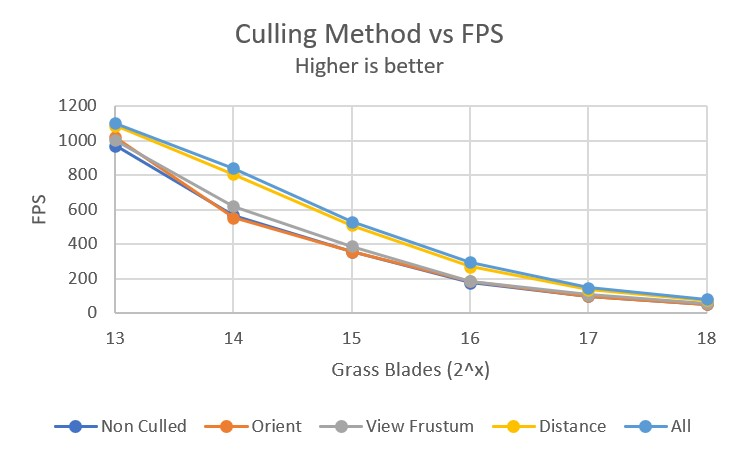

Vulkan Grass Rendering
==================================

**University of Pennsylvania, CIS 565: GPU Programming and Architecture, Project 5**

* Gene Liu
  * [LinkedIn](https://www.linkedin.com/in/gene-l-3108641a3/)
* Tested on: Windows 10, i7-9750H @ 2.60GHz, 16GB RAM, GTX 1650 Max-Q 4096MB (personal laptop)
  * SM 7.5

# Project 5: Vulkan Grass Rendering

This project implements a grass simulator and renderer using Vulkan. Grass dynamics and behavior are based off the [Responsive Real-Time Grass Rendering for General 3D Scenes](https://www.cg.tuwien.ac.at/research/publications/2017/JAHRMANN-2017-RRTG/JAHRMANN-2017-RRTG-draft.pdf) paper, which models grass appearance and movement. Grass appearance is based off Bezier curves, where the tesselation shaders within the Vulkan pipeline are used to form the grass blade shape in accordance to its control points. Grass movement is influenced by a combination of gravity, grass recovery, and wind forces, then corrected to avoid unrealistic behavior such as ground clipping. The specific formulas and theorems applied are found in the paper above.

## Blade Culling

To further improve performance, grass blades are culled in 3 ways, whose processes are once again described within the paper. The first is orientation culling, which removes any grass blades that are parallel to the camera from rendering within the graphics pipeline. This is as parallel blades will barely be visible to the camera anyways, and so removing them decreases the number of blades to be rendered while maintaining visual fidelity. This is demonstrated below:

Next, any grass blades not within the camera frustum can also be culled, as these blades will not be visible at the current viewpoint regardless. This serves to once again decrease the amount of computation needed to render the scene at low cost. This is demonstrated below in the bottom left and right corners, where we see grass blades vanish as most of their area leaves the view frustum.

Finally, we also cull grass blades based on their distance to the camera. Blades between the camera and a user defined max distance(specified to be 40 units in this case) are put into a user defined number of buckets(20 in this case). At each subsequent farther bucket from the camera, we cull a larger fraction of the blades in that bucket as per the id of the thread computing on the blade. This allows for less grass density at farther distances, where it is not needed. This once again allows the rendering of fewer blades while minimally affecting the scene visually.

## Performance Analysis

The performance of the renderer in terms of FPS was analyzed with regards to a varying number of grass blades, under different culling methods. The perspective used for the following data is the same as the one in the initial image at the beginning of this readme.

The graph above shows the FPS at different grass blade counts under no culling, only orientation culling, only view frustum culling, only distance culling, and finally all culling methods. As expected, the FPS decreases as the number of grass blades increase regardless of the culling method, as the number of triangles to render increases and so the GPU needs to spend more time processing more entities within the compute and graphics pipeline. This decrease is at a sublinear rate, as the x axis increases exponentially. 

Next, we see that in order of general performance we have all culling, then distance, then view frustum, then orientation, then no culling. There is a larger difference between the all culling and distance culling methods compared to the other 3. All culling and no culling perform the best and worst, as expected since the purpose of culling is to reduce computation and hence improve performance. Orientation culling likely has little impact due to the culling threshold set. This implementation culls blades if the dot product between the blade direction and the camera view vector is greater than 0.9, which requires both to be relatively aligned for the grass blade to be culled. This likely results in fewer grass blades culled from this method and so less of a performance gain in general. Next, view frustum culling also has small impacts to performance. This can be due to the perspective chosen above, which has minimal blades outside the camera frustum and so less computation saved. Distance culling had the most impact overall even at a camera viewpoint relatively close to the grass. The 20 buckets chosen likely came into play here to remove fractions of grass blades at farther buckets even at this distance, which saved larger amounts of computation and hence improved performance.

Finally, we see that the performance of all 5 culling variants begin to converge as we increase the grass blade count. This could be due to the ratio of culled blades to the total number of blades decreasing as the viewpoint remains the same, resulting in all methods needing to compute for more similar amounts of time.
