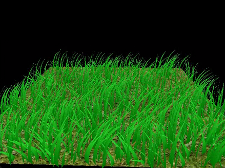
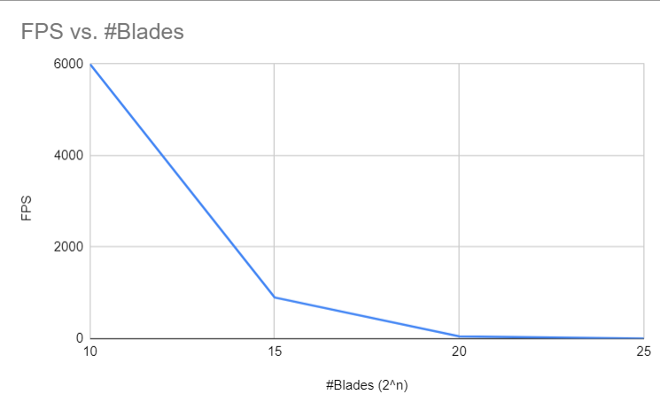
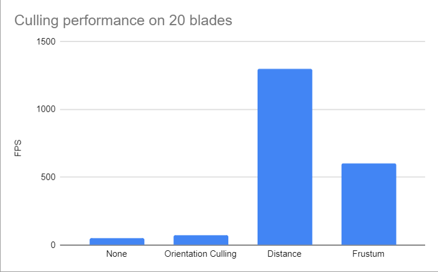

Vulkan Grass Rendering
==================================

**University of Pennsylvania, CIS 565: GPU Programming and Architecture, Project 5**

* Ruijun(Daniel) Zhong
    * [LinkedIn](https://www.linkedin.com/in/daniel-z-73158b152/)    
    * [Personal Website](https://www.danielzhongportfolio.com/)
 * Tested on: Windows 11 pro, 12th Gen Intel(R) Core(TM) i7-12700K 3.61 GHz 32.0 GB, NVIDIA GeForce RTX 3070 Ti (personal computer)

## Abstract:
This Vulkan project is based on [Responsive Real-Time Grass Rendering for General 3D Scenes](https://www.cg.tuwien.ac.at/research/publications/2017/JAHRMANN-2017-RRTG/JAHRMANN-2017-RRTG-draft.pdf). Grass blades are meticulously simulated using Bezier curves, each characterized by three control points (v0, v1, v2) that represent initial ground positions, elevated guided positions, and those affected by forces respectively. The dynamic interplay of multiple forces including environmental and gravity, recovery, and wind the behavior of these blades over time. To optimize rendering and computational tasks, the project leverages tessellation and compute shaders, further enhanced by techniques like Level of Detail (LOD) and culling, ensuring both visual authenticity and performance efficiency.

## Demo & Implmentation:
### Grass shape & Force:
Tesselation Shader(TESE):
* Grass blades are described using Bezier curves with three control points (v0, v1, v2) which influence quad's four vertices to create the shape of the grass blade..
* v0: Grass blade's base position on the geometry.
* v1: Bezier curve guide "above" v0, determining curvature.
* v2: Physical guide where forces are applied.  

Compute Shader:
* Simulations of forces (gravity, recovery, wind) applied to the v2 control point of the Bezier curve to affect grass blades.
* Resources are managed using storage buffers and descriptor sets.  

### Optimization: Culling & LOD:  
Tesselation Shader(TESC):
* (LOD) Tessellation controls detail levels based on camera proximity.

Compute Shader:
* Culling techniques include orientation, view-frustum, and distance-based methods.  

## Peformance Analysis:

  
As the chart shown, there is a clear inverse relationship between the number of blades and the frames per second (FPS). An increase in blade count, especially between 10 and 15, leads to a pronounced drop in FPS. Beyond 15 blades, the decline is more gradual, indicating potential diminishing returns on performance with added complexity.
  
Based on the chart, both Distance and Frustum culling methods offer better optimization compared to the other methods. It's possible that the Distance method is set to a greater range, resulting in more blades being culled. Similarly, the Frustum method might be utilizing a wider angle, leading to more blades being culled as well. Overall, culling blades significantly improved performance.