Vulkan Grass Rendering
==================================

**University of Pennsylvania, CIS 565: GPU Programming and Architecture, Project 5**

* Yue Zhang
  * [LinkedIn](https://www.linkedin.com/in/yuezhang027/), [personal website](https://yuezhanggame.com/).
* Tested on: Windows 11, i9-13900H @ 2.60GHz 32GB, NVIDIA GeForce RTX 4070 Laptop 8GB (Personal Laptop)
* Compute capability: 8.9

## Project View
This is a project implementing this paper: [Responsive Real-Time Grass Rendering for General 3D Scenes](https://www.cg.tuwien.ac.at/research/publications/2017/JAHRMANN-2017-RRTG/JAHRMANN-2017-RRTG-draft.pdf) in Vulkan to generate a vivid grass simulation.

This is the screenshot and recording for grass renderer with all features and default setting:
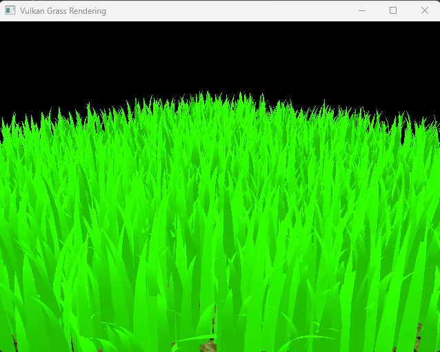

## Features
Here are the features implemented:
* Compute shader
  * Force simulation
    * Gravity
    * Recovery force
    * Wind
  * Culling tests
    * Orientation test
    * View frustum test
    * Distance test
* Grass pipeline stages
  * Vertex shader: do model transformation
  * Tessellation control shader: control tessellation level
    * Tessellation level based on distance
  * Tessellation evaluation shader: eveluate shape of grass blade based on bezier curve
  * Fragment shader: use phong shading to calculate the final color of grass
* Vulkan setups: add descriptor set layout for the compute shader and the grass vertex shader, update the descriptor sets and record command buffers. Bascially learning the complicated APIs.

### Tessellation level based on distance
The tesselation level is interpolated along `minTessLevel` and `maxTessLevel` based on the distance between camera and current `gl_position`. We draw the blades in `Quad` execution mode and we would like to add more tessellation along direction of height of blade, we assign calculated tessellation level to gl_TessLevelInner[1], gl_TessLevelOuter[0] and gl_TessLevelOuter[2] from the reference of this image(Domain parameterization for tessellation primitive modes).

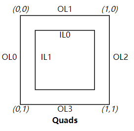

Here is the chart for FPS (base camera position) comparision upon different settings:

||
Based on distance
|
TessLevel = 3
|
TessLevel = 5
|
TessLevel = 9
|
|----|----|----|----|----|
|Image||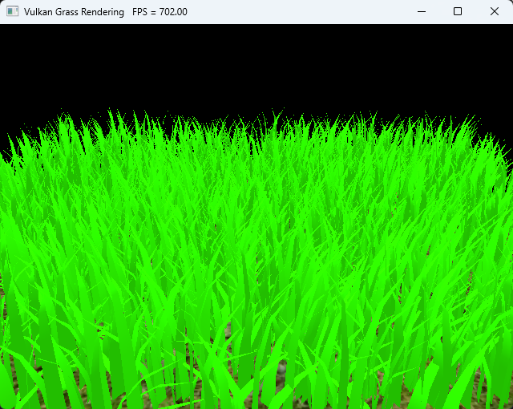|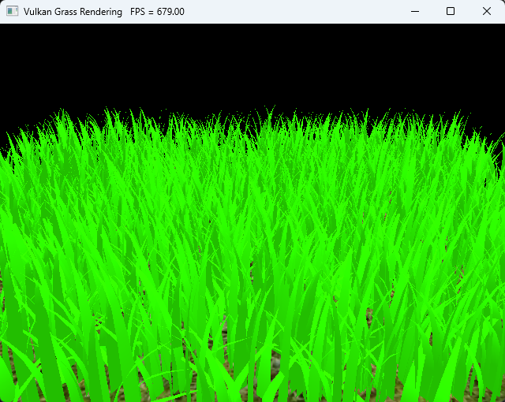|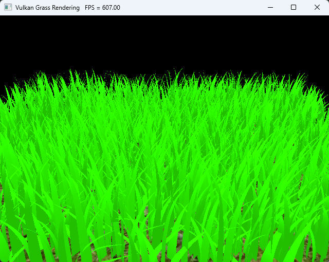|
|FPS|658|759|699|580|

Tesslevel changed based on distance keep a visually pleasant outlook while improve the frame rate other than the fixed level method.

### Force Simulation
|
Gravity
|
Recovery
|
Wind
|
Overall
|
|----|----|----|----|
|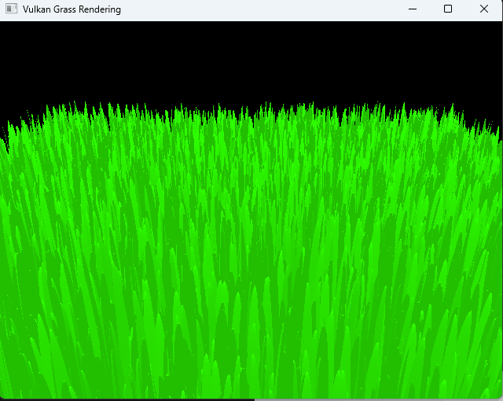|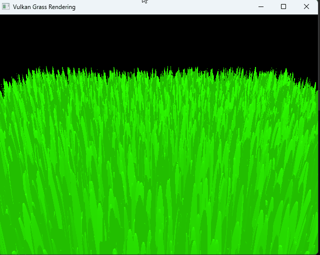|||

Here are the GIFs for seperate force take place upon v2 in compute shader. Note, only recovery force will not make visual change, so I add up recovery force and gravity force together for recovery force case.

### Culling tests
#### Orientation test
|
No test
|
threshold = 0.6
|
threshold = 0.7
|
threshold = 0.8
|
|----|----|----|----|
|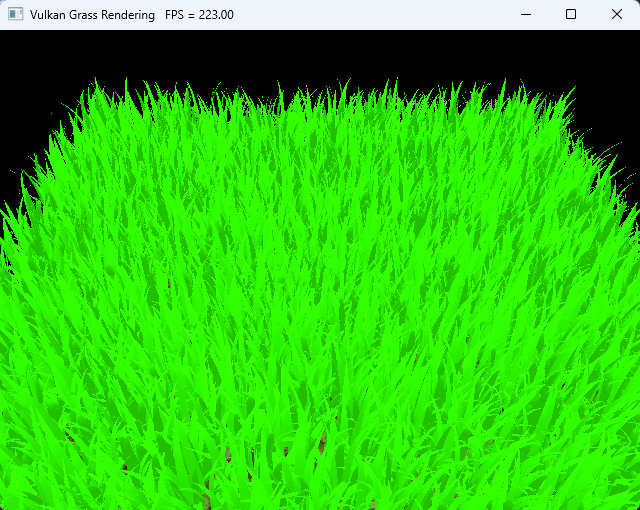|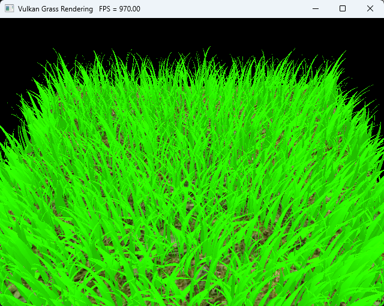|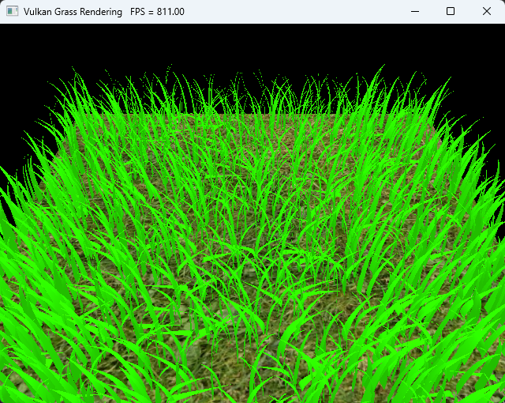|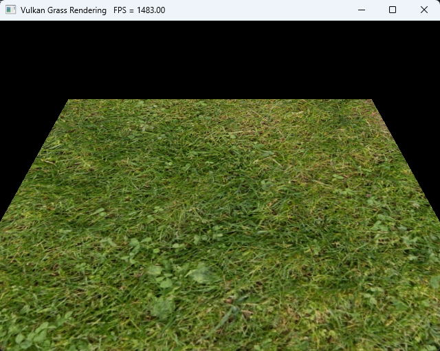|

I conducted orientation test based on the abs dot product between view direction and vector along the width of the blade. The higher threshold will cull more blades in the scene due to a stricter condition.

#### View frustum test
|
No test
|
tolerance = 0.05
|
tolerance = 0.5
|
|----|----|----|
|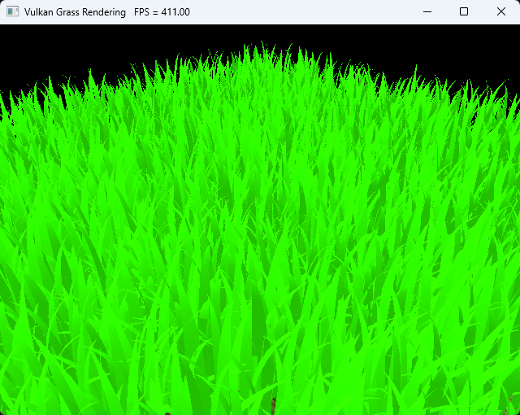|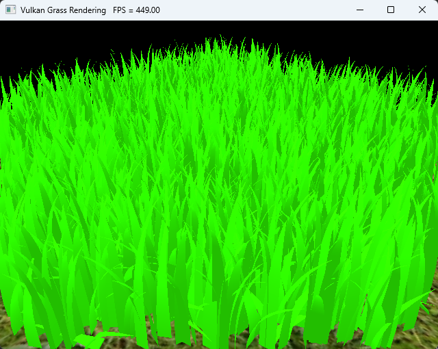|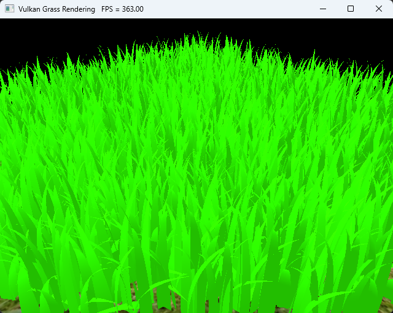|

The view frustum test remove all blades doesn't enter the view frustum away to reduce computation. Higher tolerance will has a closer result to the result without this test, by keeping more grass by the edge.

#### Distance test

Here's the comparison for no test versus test with different paramters:

No distance test:
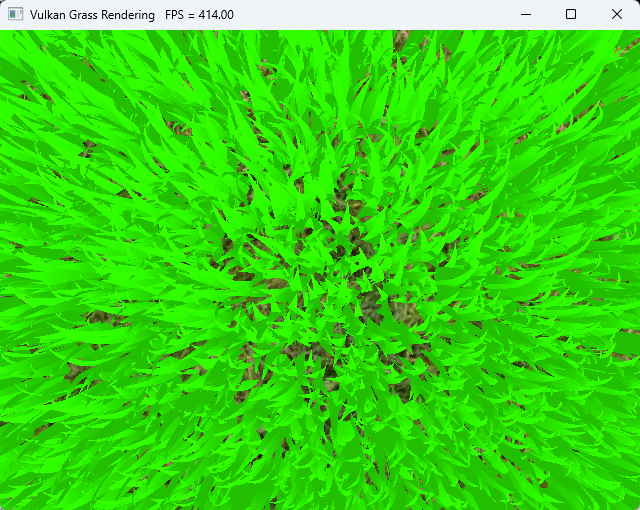

||dmax = 4|dmax = 16|
|----|----|----|
|n = 4|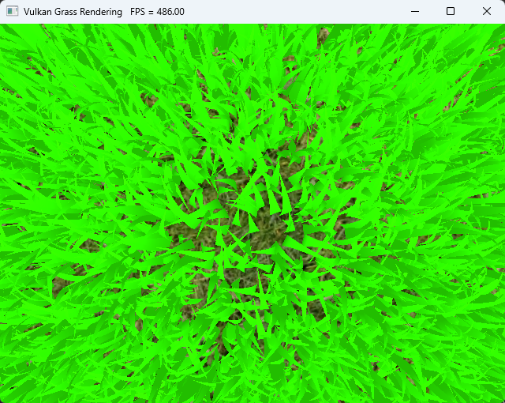|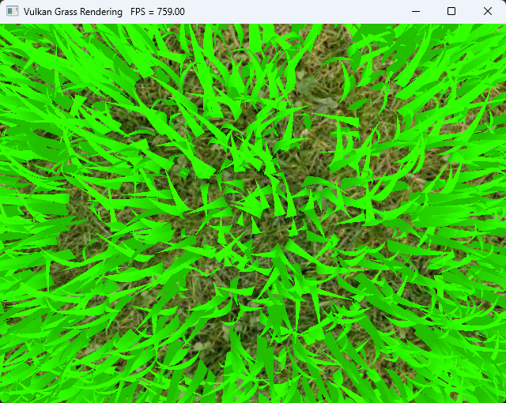|
|n = 16|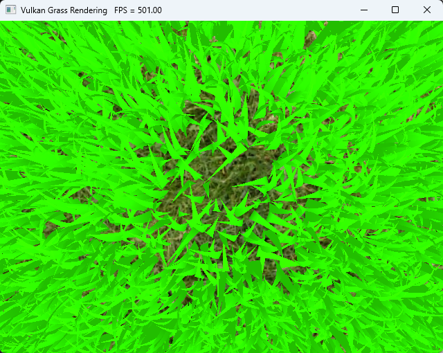|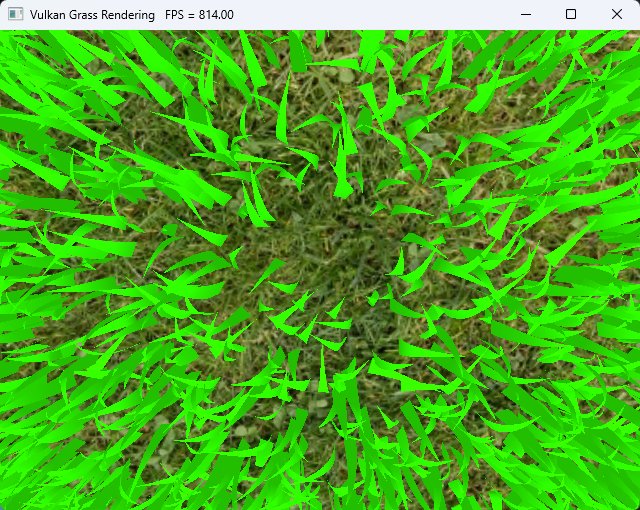|

Larger n and larger distance threshold will all increase the culled blades count.

## Performance Analysis
For all the performance test, I enabled `VK_LAYER_LUNARG_monitor` layer to display FPS on the application window title. The setting can be changed in `instance.cpp`.

### Different number of grass blades
Here is a chart of frame rate versus number of grass blades:
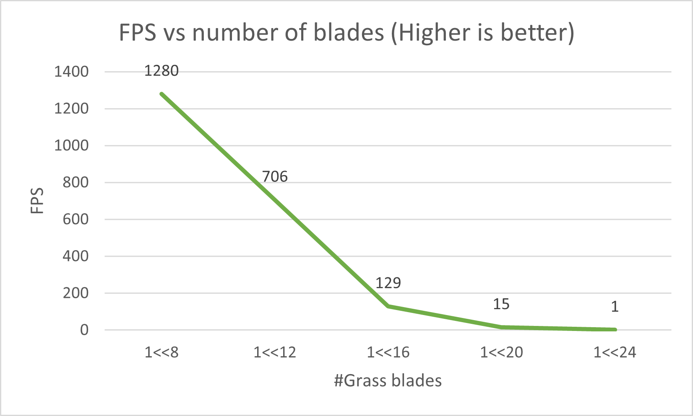

As we may suppose, the higher blade related to a lower FPS. When the blades is of reasonable count(less than 1<<16 here), the decrease of FPS is proportional to the log of #blades. Otherwise, the performance decreases in a great scale and produce a bad visual output for user.

### Improvement from culling
Here is a chart of frame rate versus different culling methods in 1<<16 blade case:
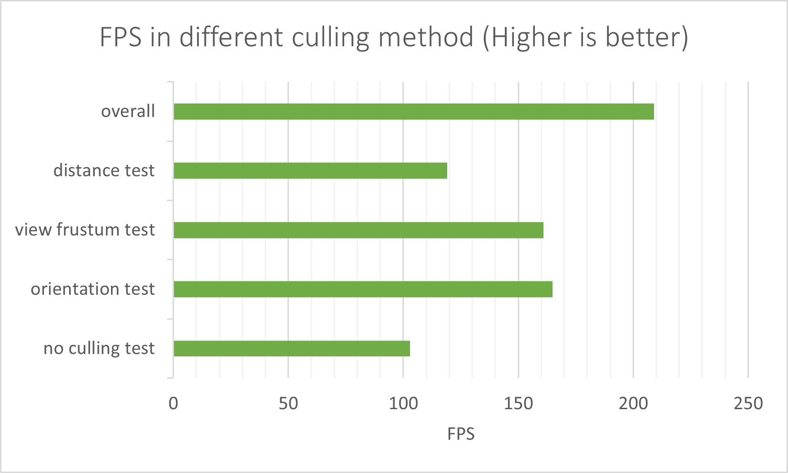

Since the effect of culling largely rely on the paramters in culling method and the camera's view direction and position, the FPS may change largely for each methods. We may conclude from this chart that the three culling methods are effective in controlling the frame rate. Especially, the orientation test and view frustum test will optmize the scene largely without hurting the visual performance for grass-dense scene.
