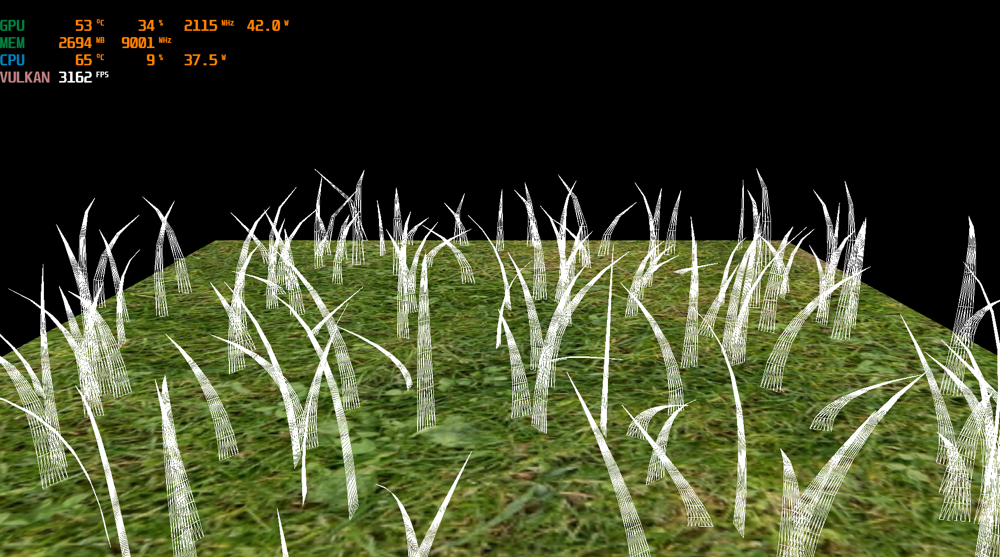
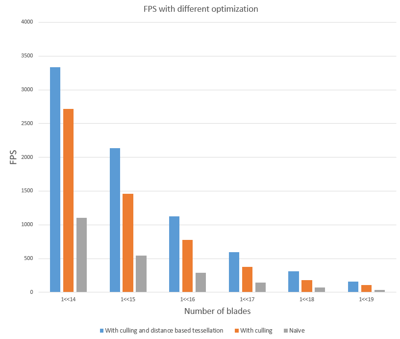

Vulkan Grass Rendering
==================================

**University of Pennsylvania, CIS 565: GPU Programming and Architecture, Project 5**

* Han Yang
  *  [LinkedIn](https://www.linkedin.com/in/han-yang-0031231a3/), [personal website](https://bdwhst.wixsite.com/portfolio), etc.
* Tested on: Windows 11, i9-12900HX @ 2.30GHz 16GB, RTX4080 laptop 12GB

## Final Result

## Principles and Analysis

In our model, each individual blade of grass is simulated using a dedicated GPU thread, ensuring a rich, dynamic appearance to the grassy landscape.

### Geometry

The geometry of each blade is foundational to its visual representation:

- **Control Points:** Every blade of grass is constructed using three pivotal control points. These points define the shape and curvature of the blade.
  
- **Tessellation:** 
  - Leveraging tessellation, we dynamically generate a multitude of discrete points. 
  - These points are derived from the bezier curve established by the control points, ensuring the blade's realistic, curved appearance.
  - The tessellated structure grants the flexibility of having varying levels of detail, potentially boosting performance without significantly compromising visual fidelity.

### Simulation

Our grass simulation, essential for a lifelike depiction, is grounded in three primary forces:

1. **Gravity Force:**
   - An omnipresent downward force, gravity ensures each blade has a natural 'droop', reflecting the real-world pull.
   - The strength of the gravity force can be modulated to simulate conditions like a waterlogged field or a dry, arid landscape.
2. **Wind Force:**
   - This dynamic force introduces motion, causing the grass to sway and rustle.
   - By altering the direction and magnitude of the wind force, various atmospheric conditions, from a gentle breeze to a raging storm, can be emulated.
   - Here I used Perlin noise to simulate the wind field
3. **Recovery Force:**
   - After any perturbation, such as a strong gust of wind, the recovery force works to restore the grass blade to its original stance.
   - It ensures that after any disturbance, the grass doesn't remain permanently deformed.

After we computed the new position by using these forces, we need a validation stage to ensure we get a robust and valid simulation for the control points.

### Culling

Culling is a crucial optimization technique, ensuring only relevant blades are rendered:

#### Direction Culling

- **Parallel Check:** If a blade's orientation is almost parallel to the viewer's line of sight, it's likely to contribute negligibly to the scene.
  - Such blades are culled to improve performance.

#### View Frustum Culling

- **Visibility Check:** The viewer's field of vision, or frustum, is a defined volume. Blades of grass outside this volume are not visible.
  - By checking a few key points on each blade against this volume, we can determine its visibility.
  - Blades found outside are culled, ensuring computational resources are focused only on visible entities.

#### Distance Culling

- **Proximity Based:** Beyond a certain distance, blades become virtually indistinguishable to the viewer.
  - We set a threshold distance, beyond which blades are culled.
- **Fading Mechanism:** 
  - Instead of abruptly culling blades at the threshold, a fading mechanism is used.
  - We cull a percentage of blades according to their projected distance to the camera.

### Distance Based Tessellation

We set the tessellation level of the blade according to its distance to the camera, the further it gets, the less tessellation level will it be.

### Performance

We tested the program under different conditions, and recorded average FPS for each case. Here we set max tessellation level to 10, min tessellation level to 2, and resolution to 800x800.

| Condition \ Num of Blades                    | 1<<14 | 1<<15 | 1<<16 | 1<<17 | 1<<18 | 1<<19 |
| -------------------------------------------- | ----- | ----- | ----- | ----- | ----- | ----- |
| With culling and distance based tessellation | 3334  | 2132  | 1124  | 598   | 311   | 160   |
| With culling                                 | 2720  | 1461  | 779   | 375   | 183   | 111   |
| Naïve                                        | 1107  | 542   | 289   | 141   | 74    | 38    |

We can see that both culling and distance based  tessellation can greatly improve our program's FPS. The improvement of culling is roughly 150%, and the improvement of distance based tessellation is roughly 40%.

