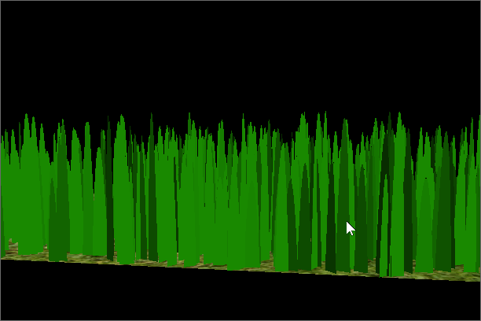

Vulkan Grass Rendering
==================================

**University of Pennsylvania, CIS 565: GPU Programming and Architecture, Project 5**

* Xiaoxiao Zou
  * [LinkedIn](https://www.linkedin.com/in/xiaoxiao-zou-23482a1b9/)
* Tested on: Windows 11, AMD Ryzen 9 7940HS @ 4.00 GHz, RTX 4060 Laptop 

### Result & Features

Features: 
- culling test
  - orientation culling test
    
  - view frustum culling test
    
  - distance culling test
    
- physics simulation (no force shown below)
  
  - gravity force
    
  - recovery force (with gravity)
    
  - wind force (with gravity and wind)
    

### Performance & Analysis

The FPS descreases as the blades counts become higher, especially when it reaches around 2^15. However, it roughly stays the same for low blades count (since threads count might be larger than blades count).

The FPS get increased for all culling method individually. (culling test on same view with same blade count). Distance culling gives better performance improvement for this certain view compared to the other twos. All together, it gives best performance improvement.
