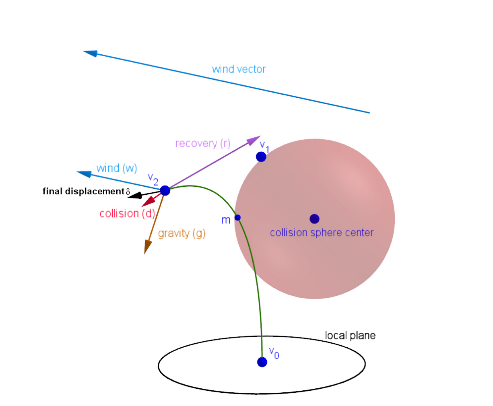
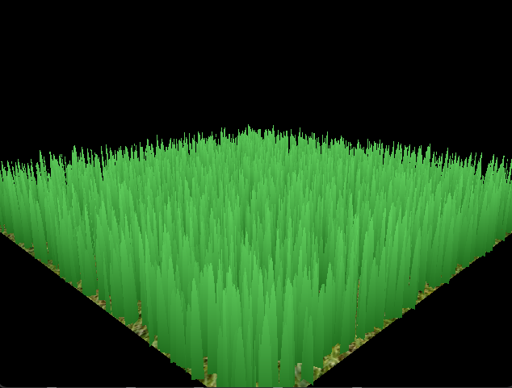
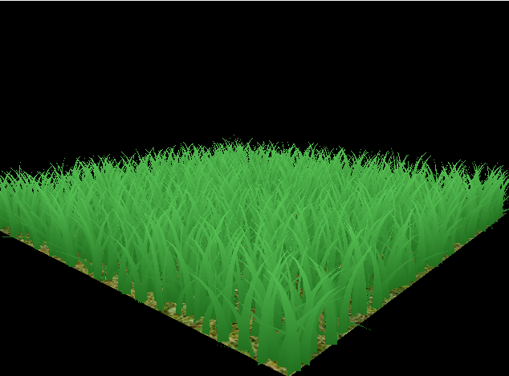
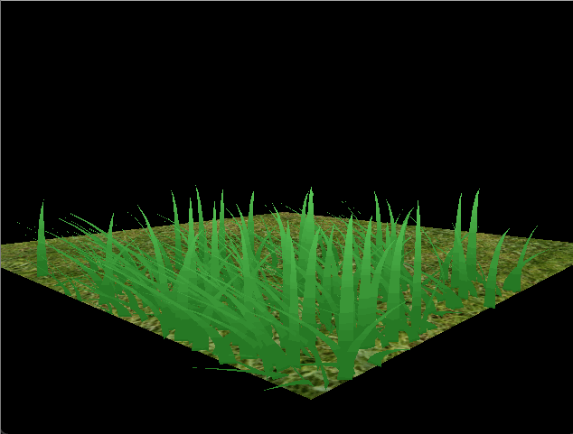

Vulkan Grass Rendering
==================================

**University of Pennsylvania, CIS 565: GPU Programming and Architecture, Project 5**

* Hanting Xu
* [GitHub](https://github.com/HantingXu), [LinkedIn](www.linkedin.com/in/hanting-xu-25615b28b).
* Tested on: (Personal Computer) Windows 11, i7-12700H @ 2.70GHz 32GB, GeForce RTX 3070 Ti Laptop GPU

### Project Description
#### General Introduction

Based on this [essay](https://www.cg.tuwien.ac.at/research/publications/2017/JAHRMANN-2017-RRTG/JAHRMANN-2017-RRTG-draft.pdf), this project simulate a field of grass using  Vulkan.

#### Core Features
* basic grass rendering using Bezier Curve.

  * 

* grass rendering with simulated force, including gravity, wind force and recovery force.

  * 

* grass culling according to the orietation of the grass, view frustrum and distance.

### Show Case
* Basic Grass Rendering without Force and Culling Applied

 * 

* With Gravity Force and Recovery Force Applied

 * 

* With All Forces Applied

  * 

* All Forces Applied with Orientation Culling

  * 

* All Forces Applied with View-Frustrum Culling

  * 

* All Forces Applied with Distance Culling

  * 

* All Features Applied

  * 

### Performance Analysis
The graph below shows the different FPS change with respect to different culling methods. The x-axis in the graph represents the number of blades to be rendered, while y-axis means the FPS. As we may observe from the graph, the FPS of the grass simulation delines as the number of blades to be drawn grows higher. And culling does greatly improve the overall performance, especially for orientation and distance culling. However, in this setting the view-frustrum culling seems to be useless and have little effect on the performance. That is probably because of the setting of the offset parameter is so small that only very few blades are culled.
* 
