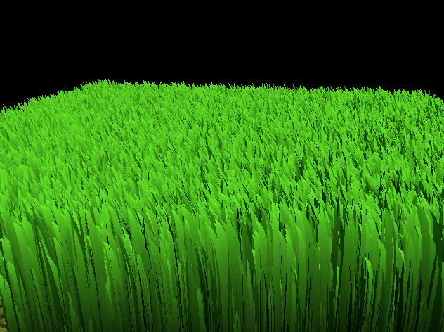
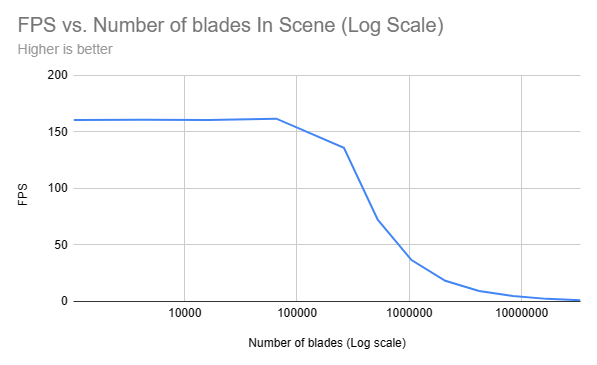
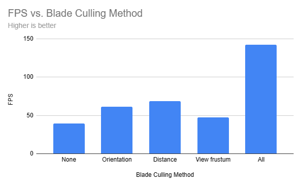

Vulkan Grass Rendering
==================================

**University of Pennsylvania, CIS 565: GPU Programming and Architecture, Project 5**

Jason Li   ([LinkedIn](https://linkedin.com/in/jeylii))
* Tested on: Windows 10, Ryzen 5 3600X @ 3.80GHz 32 GB, NVIDIA RTX 4070 

# **Summary**
This project is a GPU Grass Simulator implemented using C++ and the Vulkan API. It simulates each grass blade based on a physical model defined in [Responseive Real-Time Grass Rendering for General 3D Scenes](https://www.cg.tuwien.ac.at/research/publications/2017/JAHRMANN-2017-RRTG/JAHRMANN-2017-RRTG-draft.pdf). The simulation includes force simulation, grass blade culling, and different shaders including a tesselation shader.

Example Scene             |  
:-------------------------:|
  |

## **Tesselation Shader**
Grass blades are modeled as Bezier curves in this simulation, with three control points v0, v1, and v2. In addition, each blade has an "up vector", a width, height, orientation, and stiffness associated with it. In order to efficiently render such a shape, a tessellation shader is used to create the curvature of each grass blade from the three control points. In this simulation, we are using a "triangle-tip" shape, as described in the above reference.

Blade Model             |  
:-------------------------:|
  |

## **Force Simulation**

Three types of forces are simulated on the grass blades:
- Gravity,
- Recovery,
- and Wind.

Each of these physics-based forces is applied to the "tip" of each blade of grass (v2), following the methods given in the [above reference](https://www.cg.tuwien.ac.at/research/publications/2017/JAHRMANN-2017-RRTG/JAHRMANN-2017-RRTG-draft.pdf). The other control point v1 is updated based on the new location of v2. A time-varying wind function is used to simulate a gradually changing wind direction which is uniformly applied to each blade of grass. In addition to this, validation is required to ensure that each blade of grass remains in a "good" state, i.e. its control points stay above ground, etc. With just the forces on each blade of grass implemented, our grass simulation looks like this:

Physical Force Simulation             |  
:-------------------------:|
  |

## **Grass Blade Culling**
After the grass is sufficiently simulated, we can increase the performance of our simulation by culling grass blades that are unnecessary or cause aliasing. In this case, three types of culling were applied:
- Orientation culling,
- View-frustum culling,
- and Distance culling.

### Orientation Culling
For orientation culling, we cull the grass blades which appear nearly parallel to the camera's view direction. This is because our grass blades are only 2-dimensional, so any grass blades which are parallel or similar to the view will be rendered smaller than the size of a pixel. This can cause undesirable aliasing artifacts. Below is an example of what this looks like in our simulation.

Orientation Culling             |  
:-------------------------:|
  |

### View-frustum Culling
We also want to cull blades of grass which are outside of our field of view. This is accomplished using view-frustum culling. This method tests if all three control points of a certain blade of grass are located outside the view-frustum. If so, the blade is culled - with some tolerance to allow for grass on the edge of our view to render. An example of what this looks like in our simulation is included below.

View-frustum Culling             |  
:-------------------------:|
  |

### Distance Culling
For grass blades that are seen from a large distance, they may be rendered as a pixel or smaller. To prevent alisaing from this effect, we use distance culling - culling an increasing number of blades the further the blades' positions are from the camera.

Distance Culling             |  
:-------------------------:|
  |

## **Performance Analysis**
Below is a performance analysis of our grass simulation when compared across different runs with some changing variables. The analysis was done by choosing a standard angle to view the scene, then running the simulation with features on or off or varying the number of blades. Average FPS was aggregated over periods of 10 seconds. This standard scene is shown below.

Performance Analysis Angle             |  
:-------------------------:|
  |

### **Performance vs. Number of Blades**
FPS vs. Number of Blades             |  
:-------------------------:|
  |

The graph above compares the frames per second on average for our perforamnce analysis scene when using a different number of grass blades in the scene. As expected, the FPS drops when using a larger number of grass blades. As the number of blades is on a logarithmic scale, we can see that the performance drop is quite significant at larger numbers. This is expected, as more work has to be done per blade. However, note that this simulation does not include any interactions between blades of grass, so the performance drop with such interactions included may be even more significant.

### Performance vs. Usage of Culling
FPS vs. Culling Method (218 blades of grass)           |  
:-------------------------:|
  |

The chart above compares the frames per second on average for our performance analysis scene with 218 blades of grass when using different methods of grass blade culling. In our specific chosen scene, distance culling seems to be the most significant, as our camera view is quite far away from one edge of the platform. Orientation culling also seems to be effective, as the probability of a random blade of grass being nearly parallel with the camera's view (here we used a coefficient of 0.75) is quite large. View-frustum culling was least effective here, though this is likely due to the limited amount of grass culled in this particular view of the grass scene. The combination of all three culling methods significantly outperforms any individual method, as expected.