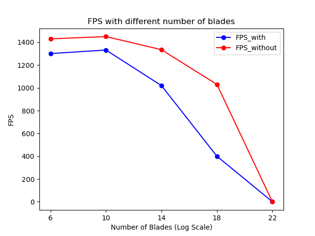

Vulkan Grass Rendering
==================================

**University of Pennsylvania, CIS 565: GPU Programming and Architecture, Project 5**

* Yian Chen
  * [LinkedIn](https://www.linkedin.com/in/yian-chen-33a31a1a8/), [personal website](https://sydianandrewchen.github.io/) etc.
* Tested on: Windows 10, AMD Ryzen 5800 HS with Radeon Graphics CPU @ 3.20GHz 16GB, NVIDIA GeForce RTX3060 Laptop 8GB

### Result

In this grass project, we have implemented a grass renderer based on [this paper](https://www.cg.tuwien.ac.at/research/publications/2017/JAHRMANN-2017-RRTG/JAHRMANN-2017-RRTG-draft.pdf). In this paper, multiple sorts of physical effect have been simulated, including gravity, restoratve, and wind forces.

### Performance Analysis

In this project, we have conducted performance analysis for this program under different number of blades with/without optimization.

