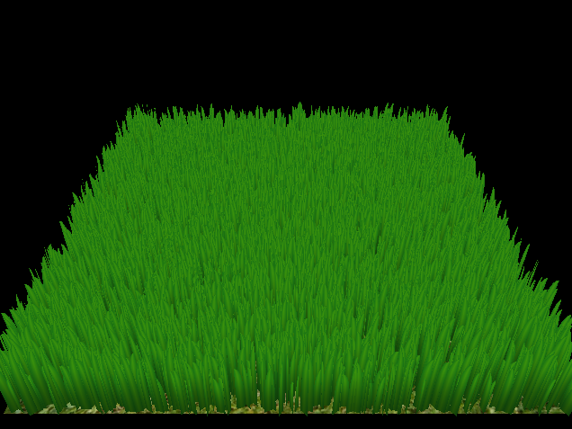

# Vulkan Grass Rendering

**University of Pennsylvania, CIS 565: GPU Programming and Architecture, Project 5**

* Aditya Gupta
  * [Website](http://adityag1.com/), [GitHub](https://github.com/AdityaGupta1), [LinkedIn](https://www.linkedin.com/in/aditya-gupta1/), [3D renders](https://www.instagram.com/sdojhaus/)
* Tested on: Windows 10, i7-10750H @ 2.60GHz 16GB, NVIDIA GeForce RTX 2070 8GB (personal laptop)
  * Compute capability: 7.5

## Introduction

This project implements a grass simulator and renderer using Vulkan, based on techniques described in the paper [Responsive Real-Time Grass Rendering for General 3D Scenes](https://www.cg.tuwien.ac.at/research/publications/2017/JAHRMANN-2017-RRTG/JAHRMANN-2017-RRTG-draft.pdf). The project uses compute shaders to perform physics calculations on Bezier curves, which represent individual grass blades. To optimize performance, the compute shader also culls blades that aren't significantly visible. The visible blades are then processed in a graphics pipeline, employing a series of shaders for various stages, including a tessellation stage.

This README contains details about the specific features implemented, as well as performance analyses highlighting the efficiency of the rendering process.

## Features

### Spline tessellation and rendering

Using tessellation shaders, we can procedurally generate spline geometry for each grass blade. The paper offers multiple different ways to parametrize each blade's width; I opted for the parabola method to create varied but sharp shapes.

### Physical force simulation

Three forces affect the grass: recovery, gravity, and wind. Recovery pushes each blade's tip back to its original position with strength proportional to the distance between the two positions. Gravity is self-explanatory. Wind is implemented as an arbitrary force calculated using Perlin noise to create a wavy carpet-like effect.

### Culling

To increase rendering performance, blades are culled by three tests. The first is that if a blade is parallel or close to parallel to the camera's view direction, it will be culled since it would barely show up anyway. The second is that blades outside the view frustum are culled since they wouldn't be visible at all regarldess. The third is that blades are culled with probability increasing as their distance from the camera decreases, as detail is less necessary in farther parts of the scene.

## Performance Analysis

### Number of blades

### Culling
