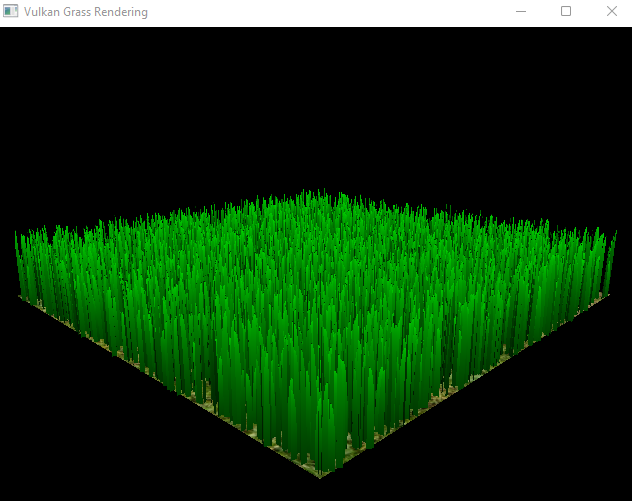
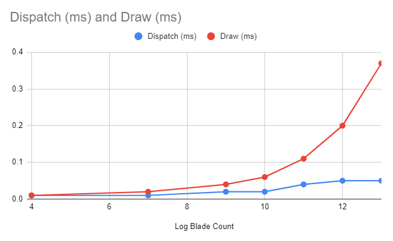
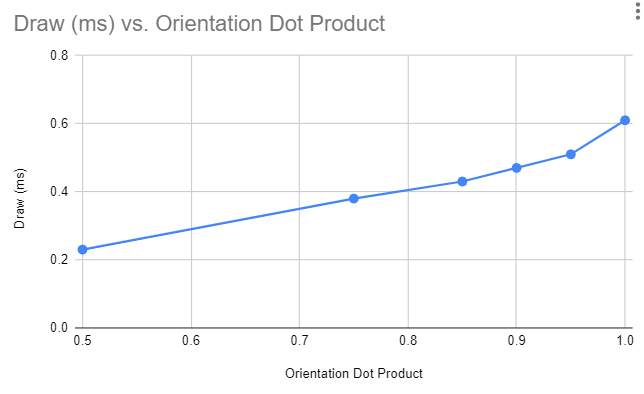

Vulkan Grass Rendering
==================================

**University of Pennsylvania, CIS 565: GPU Programming and Architecture, Project 5**

* Helena Zhang
* Tested on: Windows 11, i7-10750 @ 2.6GHz 16GB, Geforce RTX 2060 6GB

### Scenes

This field of grass is a collection of Second-degree Bezier Curves. Physical Forces - gravity, recovery, and wind forces - are applied onto each blade of grass, and any grass out of range - parallel to the camera, out of the camera's view frustum, or too far in the distance - are culled using a compute shader. Each Bezier Curve is then tessellated from the three control points to a full blade of grass. 

Grass without any forces

Various culling effects

### Analysis

As the number of blades increased, the actions done in parallel - dispatching the compute shader and drawing the grass blades - both slowed down. 

The draw function displayed expected behavior - as the number of blades increases, the number of vertices the tessellation shaders generate increases, and the runtime increases in a linear fashion. The runtime of the compute shader also increased. However, due to various factors, such as waiting for threads to sync, and the lack of sufficient significant digits used in the Nsight Graphics GPU trace analysis, the runtime appears slightly unpredictable, and it's difficult to conclude how the runtime increases as the number of blades increased. 

The culling functionality also affected the runtime of the draw function. Since view frustum and distance culling are highly dependent on the camera's position, only orientation culling provides significant runtime impact at any instance. 

Orientation culling removes any blades whose orientation is perpendicular to the camera's view angle. The dot product represents a threshold where a blade would be removed even if it isn't fully perpendicular, but it would appear very thin on camera. As the threshold decreases, more blades would fall into the threshold zone, and they would be removed. The dot product and runtime decreased in a linear fashion, meaning the blades are uniformly distributed in terms of orientation. However, there is a large runtime difference between culling 5% of the blades versus keeping all of blades. It's possible this is caused by z-fighting when all the vertices on the grass blade are colinear with each other from the view of the camera. 
