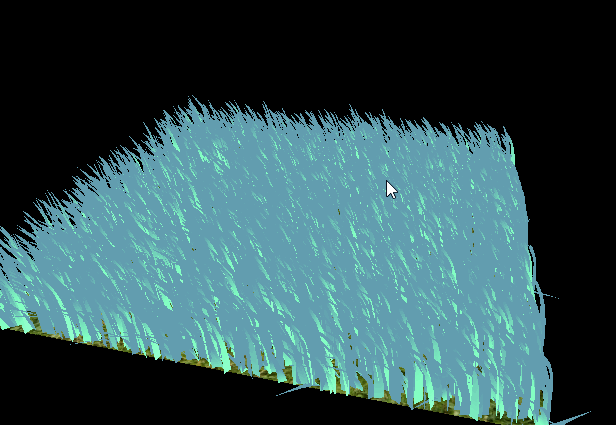
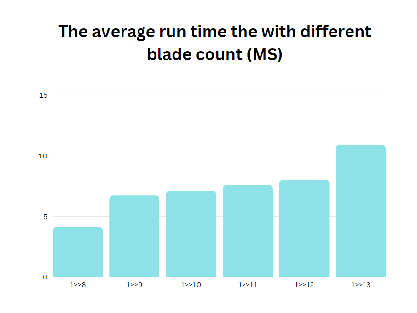
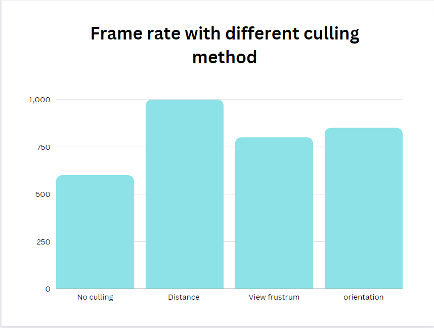

Vulkan Grass Rendering
==================================

**University of Pennsylvania, CIS 565: GPU Programming and Architecture, Project 5**

* Han Wang

* Tested on: Windows 11, 11th Gen Intel(R) Core(TM) i9-11900H @ 2.50GHz  22GB, GTX 3070 Laptop GPU

## Summery

This project involves the creation of a grass rendering system built on the foundation of Vulkan. The primary tasks encompass three essential components: The rendering pipeline, compute shader and grass simulation. The rendering pipeline follows the standard Vulkan structure, progressing through the vertex shader, tessellation control shader, primitive generator, tessellation evaluation shader, geometry shader, and finally the fragment shader. In our pursuit of enhancing rendering efficiency, particularly when dealing with the complex demands of rendering grass, I strategically prioritized the implementation of the compute shader ahead of the fragment shader. Furthermore, I incorporated a sophisticated culling system designed to eliminate unnecessary computations in areas not visible, thereby significantly improving both efficiency and performance. This culling system comprises distance culling, view-frustum culling, and orientation culling.

## Analysis

Based on the output I got, I tested the different numbers of blades and their run time on the rendering part and got the following graph:

Also, since I've implemented all three different culling methods, I tried to implement them separately and get the following graph:

