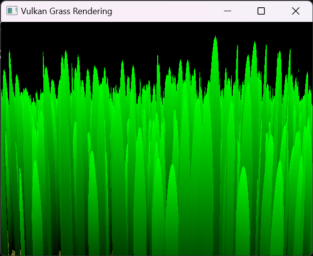
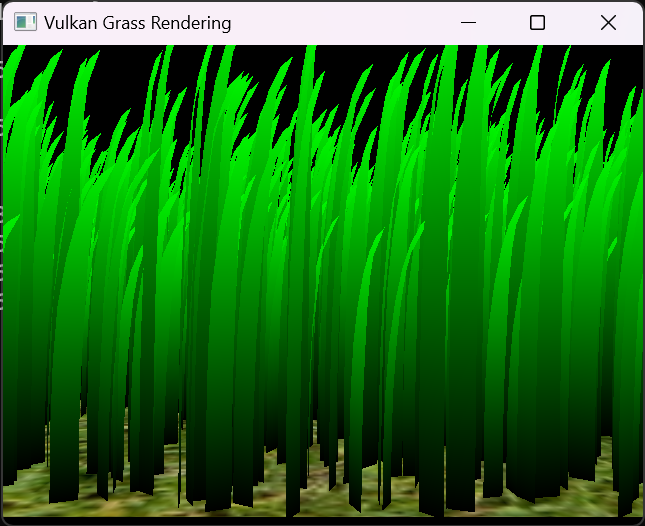
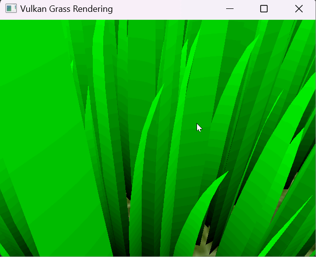

Vulkan Grass Rendering
==================================

**University of Pennsylvania, CIS 565: GPU Programming and Architecture, Project 5**

* Tianyi Xiao
  * [LinkedIn](https://www.linkedin.com/in/tianyi-xiao-20268524a/), [personal website](https://jackxty.github.io/), [Github](https://github.com/JackXTY).
* Tested on: Windows 11, i9-12900H @ 2.50GHz 16GB, Nvidia Geforce RTX 3070 Ti 8032MB (Personal Laptop)

### Description

In this project, I use Vulkan to implement a grass simulator and renderer. The culling and wind deformation is calculated in compute shader, and the interpolation is done in tessellation shader to get the acurate grass blade shape from Bezier curve dynamically.

Fianl Result:

 

### Implementation Stages

First, with tessellation, we can get static grass with correct shape.

 

Then, the wind force function is implemented in compute shader, which bend the grass.

 

Then, unnecessary grass baldes are culled out with three cull test.

Orientation Test:  Cull grass baldes that nearly parpendicular to camera.

 

View frustrum Test:  Cull grass blades that outside the view frustrum.

(There are grass showed up on the edge of view frustrum.)

 
 

View frustrum Test:  Cull grass blades according to distance. A further grass blade has higher chance to be culled out.

 

### Analysis

The analysis graph is below, where render time with three different cull test is recorded seperately.

From the graph we can see that, three cull methods all have contribution, and among them, the importance are: distance > orientation > view frustrum.

I think the reason is that, the distance test can cull many unimportant grass far away from the camera. And the orientation will also cull some grass, but since the orientatino of grass is distributed uniformly, so the ratio of grass culled by orientation test is nearly fixed and less than distance test.

For view frustrum test, if there are lots of grass outside the view frustrum, like behhind the camera, this test would be more useful. But in my test case, I didn't put camera in front of much grass on purpose, so this test just help a little compared with the other two tests.