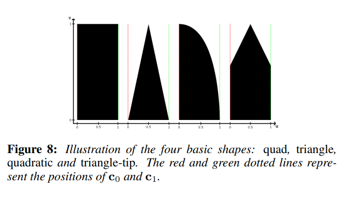
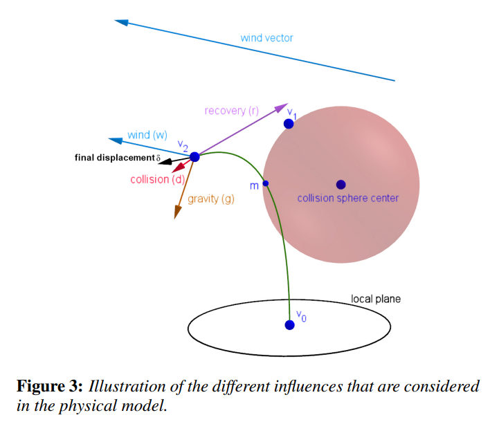
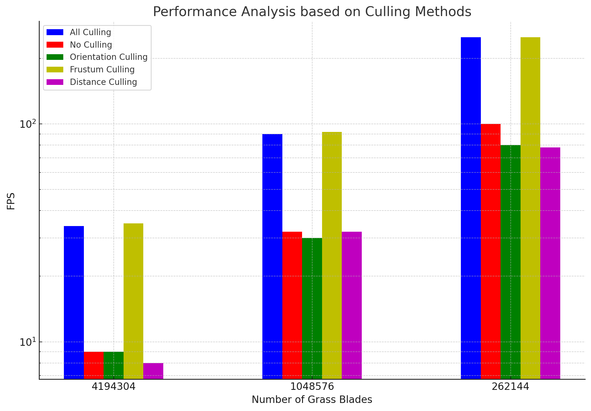

Touching Grass in Vulkan
==================================


* Jason Xie, October 2023

## About

A grass simulation in Vulkan. 

This project implements the paper [Responsive Real-Time Grass Rendering for General 3D Scenes](https://www.cg.tuwien.ac.at/research/publications/2017/JAHRMANN-2017-RRTG/JAHRMANN-2017-RRTG-draft.pdf), including Bezier curve grass blades, physical models for grass motion, and culling.

## Features

### 🌿 Bezier Curve Grass Blades

Grass is represented as Bezier curves, where $v_0, v_1, v_2, v_3$ are the control points. In addition to these control points, the direction, height, width, and the "up" vector are also stored, resulting in four vec4s per grass blade.


To draw the grass, vertices from the initial quad is refined through the tessellation shader. First, two separate Bezier curves are generated for each side of the grass blade. Then, the vertex position is determined by interpolating between the two curves.



### 🌿 Physical Models



Grass motion is modeled as displacements of the grass tip $v_2$ due to a comination of forces.

**🌎️ Gravity**

Gravity is simulated as a combination of *environmental gravity* and *frontal gravity*:

$g = g_e + g_f$

$g_f = \frac{1}{4} ||g_e|| f$

**🌬️ Wind**

The deflection of grass due to wind is modeled as a function of wind magnitude and grass alignment with the wind direction:

$w = w_i(v_0) \theta(w_i(v_o), h)$

Wind vector is modeled as a function of position and time, and it is layered using progressively smaller sinusoids.


**🪃 Recovery**

Elastic forces that help the grass bounce back is modeled using Hooke's law:

$r = (I_{v_2} - v_2) s$

### 🌿 Culling


To allow for fast simulations, grass blades are culled through a combination of orientation culling, frustum culling and distance culling.

**Orientation Culling**

Grass blades that are not facing the camera are culled. This is done by checking the angle between the camera direction and the grass blade direction.

**Frustum Culling**

Grass blades that are outside of the view frustum are culled. Culling is performed by checking the intersection between the grass blade control points and the view frustum.

**Distance Culling**

Grass blades that are too far away from the camera are culled. 

## Performance Analysis

Let's analyze the impace of culling and number of grass blades on the performance of the simulation.

**All Culling**

| Number of Grass Blades | FPS |
| ---------------------- | --- |
| 2^22                   | 34  |
| 2^20                   | 90  |
| 2^18                   | 250 |

**No Culling**

| Number of Grass Blades | FPS |
| ---------------------- | --- |
| 2^22                   | 9  |
| 2^20                   | 32  |
| 2^18                   | 100  |

**Orientation Culling**

| Number of Grass Blades | FPS |
| ---------------------- | --- |
| 2^22                   | 9  |
| 2^20                   | 30  |
| 2^18                   | 80  |

**Frustum Culling**

| Number of Grass Blades | FPS |
| ---------------------- | --- |
| 2^22                   | 35  |
| 2^20                   | 92  |
| 2^18                   | 250  |

**Distance Culling**

| Number of Grass Blades | FPS |
| ---------------------- | --- |
| 2^22                   | 8  |
| 2^20                   | 32  |
| 2^18                   | 78  |



From the analysis, it appears that frustrum culling has the most impact on FPS. This is likely because in a large scene, the vast majority of blades will be hidden from view. 

## Build & Run

```bash
bash build.sh debug
cd bin && ./vulkan_grass_rendering
```
