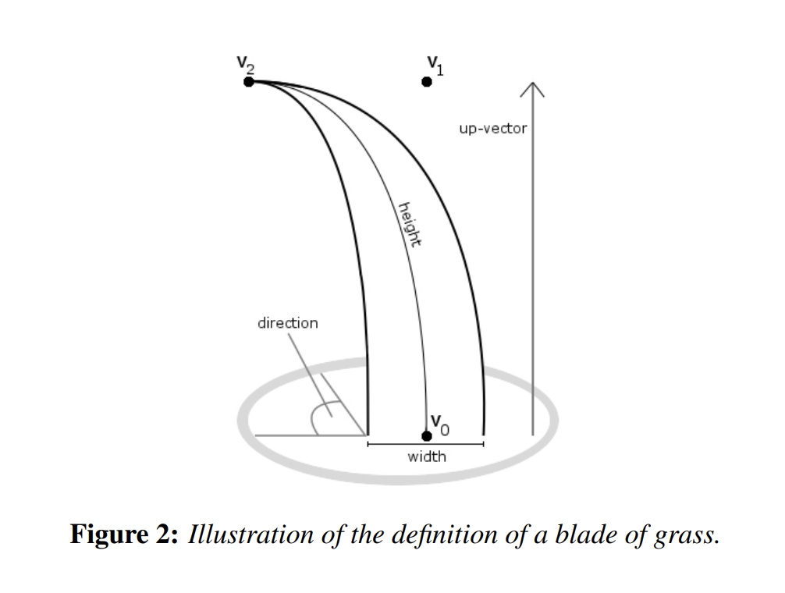
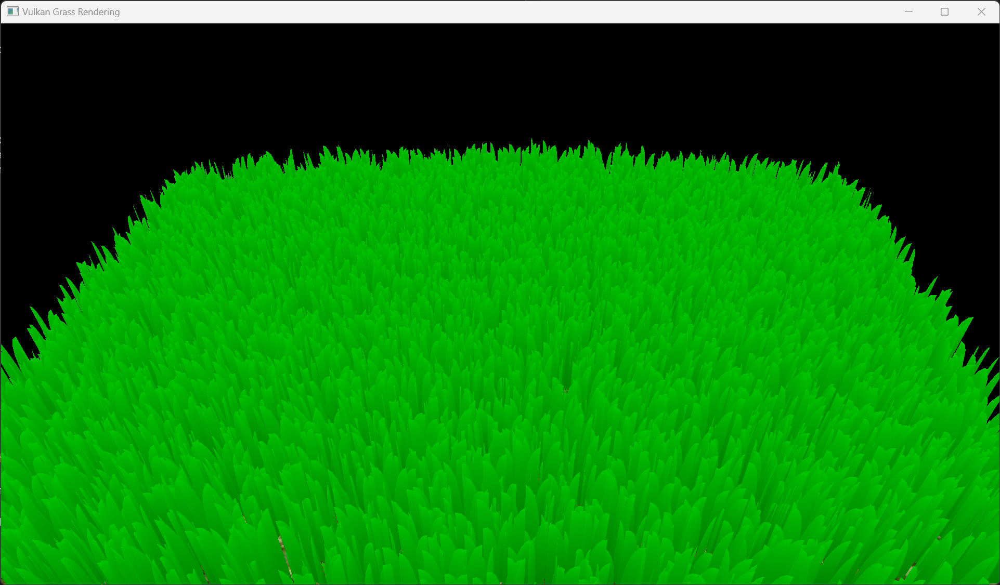
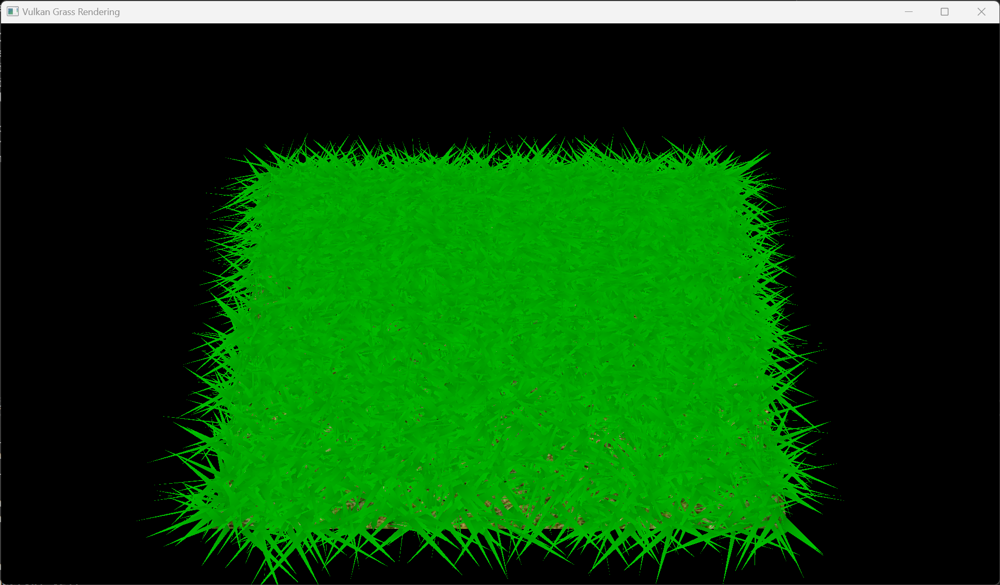
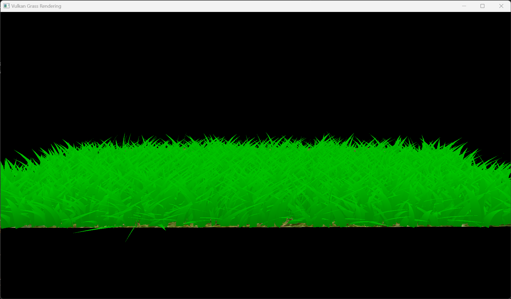
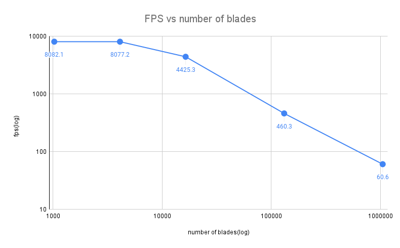
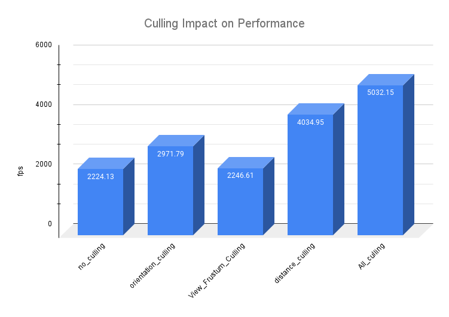
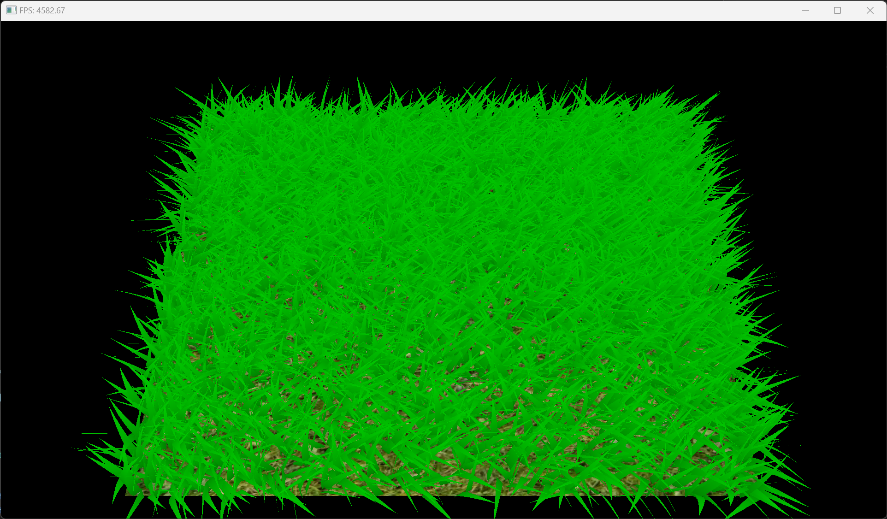

Vulkan Grass Rendering
==================================

**University of Pennsylvania, CIS 565: GPU Programming and Architecture, Project 5**

* Xitong Zheng
  * [LinkedIn](https://www.linkedin.com/in/xitong-zheng-5b6543205/), [Instagram](https://www.instagram.com/simonz_zheng/), etc.
* Tested on: Windows 11, i7-12700k 32GB, GTX 4090 24GB

## Intro
The project use vulkan to implement of the paper, Responsive Real-Time Grass Rendering for General 3D Scenes.

## Features
The project contains the following components:
- Physical Simulation: Gravity, wind, and recovery force
- Rendering: tessellation and shading of grass 
- culling: orientation culling, view-frustum culling, and distance culling

## Grass model
In this project, grass blades will be represented as Bezier curves while performing physics calculations and culling operations. 

Each Bezier curve has three control points.
* `v0`: the position of the grass blade on the geomtry
* `v1`: a Bezier curve guide that is always "above" `v0` with respect to the grass blade's up vector (explained soon)
* `v2`: a physical guide for which we simulate forces on

We also have the following per-blade characteristics that will help us simulate and tessellate our grass blades correctly.
* `up`: the blade's up vector, which corresponds to the normal of the geometry that the grass blade resides on at `v0`
* `Orientation`: the orientation of the grass blade's face
* `Height`: the height of the grass blade
* `Width`: the width of the grass blade's face
* `Stiffness coefficient`: the stiffness of our grass blade, which will affect the force computations on our blade

## Physical Simulation
Gravity, wind, and recovery force are included per blade in the simulation model. 
### No Force

### Gravity

### Gravity and Recovery

### Gravity, Recovery and Wind

## Culling

### Orientation Culling

### View Frustum Culling

### Distance Culling

## Performance Analysis
### Varying numbers of grass blades

### Improvement by culling

test scene: 2^14 blades
