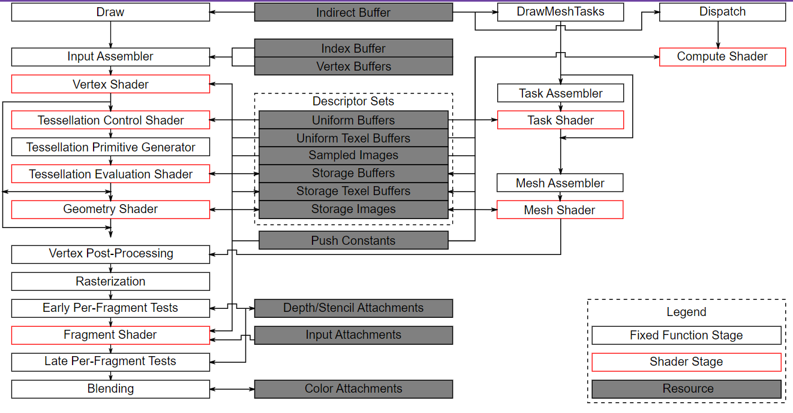

Vulkan Grass Rendering
==================================

**University of Pennsylvania, CIS 565: GPU Programming and Architecture, Project 5**

* Linda Zhu: [Linkedin](https://www.linkedin.com/in/lindadaism/)
* Tested on: Windows 11, i7-12800H @ 2.40GHz 16GB, NVIDIA GeForce RTX 3070 Ti (Personal Laptop)

## Overview

In this project, I use Vulkan to implement a grass simulator and renderer. I use tessellation shaders to perform physics calculations on Bezier curves that represent individual grass blades. To add an organic look to the grass field, I use the compute shader to apply three types of natural forces, namely environmental gravity, wind, and self-recovery, to the blades. Since rendering every single blade on every frame is fairly inefficient, I also use the compute shader to cull grass blades that don't contribute to a given frame. The remaining blades are then passed to a graphics pipeline, where I write a vertex shader to transform Bezier control points, tessellation shaders to dynamically create the grass geometry from the Bezier curves, as well as a fragment shader to color the grass blades with lambertian shading.

This project is based off the paper [Responsive Real-Time Grass Rendering for General 3D Scenes](https://www.cg.tuwien.ac.at/research/publications/2017/JAHRMANN-2017-RRTG/JAHRMANN-2017-RRTG-draft.pdf) by Jahrmann and Wimmer.

## Grass Geometry
In this project, grass blades will be represented as Bezier curves while performing physics calculations and culling operations (Figure 2). 

Each Bezier curve has three control points.
* `v0`: the position of the grass blade on the geomtry
* `v1`: a Bezier curve guide that is always "above" `v0` with respect to the grass blade's up vector (explained soon)
* `v2`: a physical guide for which we simulate forces on

We also need to store per-blade characteristics that will help us simulate and tessellate our grass blades correctly.
* `up`: the blade's up vector, which corresponds to the normal of the geometry that the grass blade resides on at `v0`
* Orientation: the orientation of the grass blade's face
* Height: the height of the grass blade
* Width: the width of the grass blade's face
* Stiffness coefficient: the stiffness of our grass blade, which will affect the force computations on our blade

We pack all this data into four `vec4`s, such that `v0.w` holds orientation, `v1.w` holds height, `v2.w` holds width, and `up.w` holds the stiffness coefficient.


## Vulkan Pipeline
Below is an overview of the basic Vulkan pipeline from the [Vulkan documentation](https://docs.vulkan.org/spec/latest/chapters/pipelines.html).



*Figure 3. Vulkan Pipeline Diagram*

For this project, we are already provided with a basic Vulkan setup, including a compute pipeline that will run our compute shaders and two graphics pipelines, one for rendering the geometry that grass will be placed on and the other for rendering the grass itself. Our focus is to write the shaders for the grass graphics pipeline (`grass.vert`, `grass.tesc`, `grass.tese` and `grass.frag`) and the compute pipeline (`compute.comp`), as well as binding necessary resources (descriptors) to accomplish the tasks above.

**Courtesy of an amazing CGGT alumni [Rhuta Joshi](https://github.com/rcj9719/gpu-vulkan-grass-rendering/)**, the following diagram shows clearly the workflow at different stages of the Vulkan pipeline in order to render and simulate realistic grass.


*Figure 4. Vulkan Grass Pipeline Diagram*

### Tessellation
Knowing how to compute the mathematical surface of a glass blade using Bezier curve, we now need to generate a triangulated mesh using tessellation shaders.

Tessellation is the vertex processing stage in a graphics pipeline where patches of vertex data are subdivided into smaller primitives. The core components are two shaders and in between them a fixed function stage. The first shader is Tessellation Control Shader (TCS), the fixed function stage is the Primitive Generator (PG), and the second shader is Tessellation Evaluation Shader (TES).

Our TCS `grass.tesc` takes an input patch of blade's 3 control points, and emits an output patch. Additionally, we set the tessellation levels in TCS to determine how many triangles will be generated for each patch. Note that we are using quads (a normalized square of 2D coordinates in the range of 0-1) as our patch domain, specified in the `layout` seciton of out TES `grass.tese`. This means that all 4 outer and 2 inner tessellation levels are used (Figure 5).


*Figure 5. Tessellation Level Diagram for Quads*

Next, in TES `grass.tese` we can decide the actual clip space vertex positions using De Casteljau's algorithm. The table below shows the process of remapping the tessellated vertices within a quad to shape it like a gradd blade.

 Original quad patch | Remapped patch |
|---|---
 | 

Then it comes to our first grass blade:


And (drum roll...) lush grass!


## Natural Forces
In this project, we also simulate natural forces on grass blades while they are still Bezier curves. This is done in the compute shader. Remember that `v2` is our physical guide (Figure 2), so we apply transformations to `v2` initially and then make corrections for potential errors. Lastly we update `v1` to maintain the appropriate length of our grass blade.

Again, the primary source of the mathematical formulas of force calculations is the paper [Responsive Real-Time Grass Rendering for General 3D Scenes](https://www.cg.tuwien.ac.at/research/publications/2017/JAHRMANN-2017-RRTG/JAHRMANN-2017-RRTG-draft.pdf).

### Gravity
Given a gravity direction, `D.xyz`, and the magnitude of acceleration, `D.w`, we can compute the environmental gravity in our scene as `gE = normalize(D.xyz) * D.w`. Note that `D.w` doesn't have to equal the real gravity 9.8 depending on how bent you want your grass blades appear.
We then determine the contribution of the gravity with respect to the front facing direction of the blade, `f`, as a term called the "front gravity". Front gravity is computed as `gF = 0.25 * ||gE|| * f`.

Finally we determine the total gravity on the grass blade as `totalGravity = gE + gF`.

Gravity Only |
---|
 |

### Recovery
Recovery corresponds to the counter-force that brings our grass blade back into equilibrium. This is derived in the paper using Hooke's law. In order to determine the recovery force, we need to compare the current position of `v2` to its original position before simulation started, `iv2`. At the beginning of our simulation, `v1` and `v2` are initialized to be a distance of the blade height along the `up` vector.

Once we have `iv2`, we can compute the recovery forces as `recoveryForce = (iv2 - v2) * stiffness`.

Gravity + Recovery |
---|
 |

### Wind
In order to simulate wind, I create my wind direciton as a simple function of the position `v0` and the total elasped time using `sin` and `cos` to animate the movement.
The wind vector directly affects the blade, but it is also worth noting that wind has a larger impact on grass blades whose forward directions are parallel to the wind direction. The paper describes this as a "wind alignment" term.

Once we have a wind direction and a wind alignment term, we determine our total wind force as `windForce = windDirection * windAlignment`.

Wind Only |
---|
 |

### Total Force
Finally, we can determine a translation for `v2` based on the total force as `totalForce = (gravity + recovery + wind) * deltaTime`. However, we can't simply apply this translation and expect the simulation to be robust. Our forces might push `v2` under the ground! Similarly, moving `v2` but leaving `v1` in the same position will cause our grass blade to change length, which doesn't make sense.

We need to perform a set of state validation tests to correct the final positions for `v1` and `v2`:
1. Ensure `v2` is always above the ground.
2. Adjust `v1` so that the blade is not stretched.
3. Ensure blade length stasy approximately the same.

Under All Forces |
---|
 |

## Optimization: Culling
Although we need to simulate forces on every grass blade at every frame, there are many blades that we won't need to render due to a variety of reasons.To optimize our current implementation, we perform additional three types of culling tests based on the blade orientation, blade's relative position with respect to camera's view-frustum and blade's distance from the camera.

### Orientation
Consider the scenario in which the front face direction of the grass blade is perpendicular to the view vector. Since our grass blades have no thickness, we will end up trying to render parts of the grass that are actually smaller than the size of a pixel. This could lead to aliasing artifacts.

In order to remedy this, we can cull these blades! Simply do a dot product test to see if the view vector and front face direction of the blade are perpendicular. 

The demo gif below has a threshold value of `0.6` just so I can show how prominent the impact orientation culling can have. It's up to the developer's choice how you effective you want your orientation culling to be.


### View-Frustum
We also want to cull blades that are outside of the camera's view-frustum, considering they won't show up in the frame anyway. To determine if a grass blade is inside the view-frustum, we want to compare the visibility of three points: `v0, v2, and m`, where `m = 0.25 * v0 + 0.5 * v1 + 0.25 * v2`.

Notice that we aren't using `v1` for the visibility test. This is because the `v1` is a Bezier guide that doesn't represent a position on the grass blade. We instead use `m` to approximate the midpoint of our Bezier curve.

If all three points are outside of the view-frustum, we cull the grass blade. The paper uses a tolerance value `0.1` for this test so that we are culling blades a little more conservatively. This can help with cases in which the Bezier curve is technically not visible, but we might be able to see the blade if we consider its width. 

The gif below has a tolerance value of `-3` just for demonstration purposes.


### Distance
Similarly to orientation culling, we can end up with grass blades that at large distances are smaller than the size of a pixel. This could lead to additional artifacts in our renders. In this case, we can cull grass blades as a function of their distance from the camera.

I define two custom parameters here:
* A max distance `MAX_DIST` afterwhich all grass blades will be culled.
* A number of buckets `NUM_DIST_LEVEL`, aka 'distance levels' in the paper, to place grass blades between the camera and max distance into.

With these two parameters, we need to define a function such that the grass blades in the bucket closest to the camera are kept while an increasing number of grass blades are culled with each farther bucket. I use the inequality function provided in the paper to cull any blade that matches the condition: `bladeIndex mod NUM_DIST_LEVEL < int(floor(NUM_DIST_LEVEL * (1 - dProj / MAX_DIST)))`, where `dProj = length(viewDir)` is the projected distance of view vector onto the local plane defined by blade's up vector.

The demo gif below uses a `MAX_DIST` of `30.0` and a `NUM_DIST_LEVEL` of `10`.


## Performance Analysis
For all the test cases I set both the inner and outer tessellation levels to 8. Test cases that involve any culling method has the same configuration below:

```
orientation threshold = 0.6, frustum tolerance = 0.2, maximum distance = 20.0 and number of distance levels = 10
```
### Varying Number of Blades
To see how my renderer handles various number of grass blades, I compared the FPS difference with an increasing number of grass blades. I placed the camera slightly above the default position so that most of the grass can be seen. I measured the frame rate with both culling turned off and all three culling methods on.


As expected, frame rates drop dramatically with an increasing amount of grass blades, no matter whether culling is integrated. With all three types of culling tests on, we can achieve a performance boost by 20~60 percent, especially when the number of blades exceeds 2<sup>12</sup>. While how much culling-ON outperforms culling-OFF may depend on how rigrous the culling tests are, this phenomenon is still reasonable because when there are only a few grass blades, the computational and rendering time is relatively insignificant in comparison to the time allocated to other aspects of the program, notably the synchronization between the CPU and GPU.

### Different Culling Tests
To see how different culling tests contribute to performance, I compare the FPS difference with each culling test. In addition, I also zoomed in half way until my camera can't zoom in more, and place the camera farther away from the ground plane, to test the influence of camera motion on both view-frustum culling and distance culling, respectively. 


Distance culling and orientation culling has similar contributions while frustum culling seems to have no benefit, even slower. This is because with the initial camera settings, all the grass blades are visible/ reside within the view frustum so we are still updating every single blade every frame, except that now we are performing extra computation. The closer the camera is to the scene, the more significant view-frustum culling has impact on the performance because more grass are cut out of the screen and not rendered. Conversely, the farther the camera is, the better distance culling performs since more grass to be culled is beyond the maximum distance.

### Dynamic Tessellation Level
Since the advantages of various culling tests are driven by camera placement, I want to seek a method to simplify the blade geometry itself, rather than removing that entire blade. Reducing the mesh polygon count on the grass blade based on some criteria directs me back to TCS. We can change levels of detail (LOD) for each patch based on how far the grass blade is from the camera. For example, if the blade is very far, only generate four vertices in TCS.

My algorithm halves the LOD iteratively given two rings of hard-coded distance ranges.
```
float computeTessLevel(float distCamToBlade)
{
    float lod = DEFAULT_TESS_LEVEL;
    if (distCamToBlade > 10.0)
    {
        lod *= 0.5;
    }
    if (distCamToBlade > 20.0)
    {
        lod *= 0.5;
    }
    return lod;
}

```

You can see the LOD of the middle blade changes when the camera zooms in/out. |
---|
 |

Replacing the fixed tessellation level with dynamic LOD, even without any culling method, the same test case (# blades = 2<sup>14</sup> in Different Culling Tests) now yields an average FPS of `690.5`, versus the original `280.3` in the chart above. With ALL culling tests on, dynamic LOD has an average FPS of `1853.2`, versus the original `701.8`. The speedup makes sense because we inherently process/render less vertex data. If time permits, I'd like to measure the performance with various culling tests turned on to solidify a more convincing conclusion. 

One drawback of dynamic tessellation level is that it sacrifices visual quality as we lose details for objects farther away. Nevertheless, balancing computation resources and high standard visuals is always something subjective the developers have to decide.

## Resources
* [Responsive Real-Time Grass Grass Rendering for General 3D Scenes](https://www.cg.tuwien.ac.at/research/publications/2017/JAHRMANN-2017-RRTG/JAHRMANN-2017-RRTG-draft.pdf)
* [Rhuta's Vulkan Grass Notes](https://github.com/rcj9719/gpu-vulkan-grass-rendering/))
* [Official Vulkan documentation](https://www.khronos.org/registry/vulkan/)
* [RenderDoc blog on Vulkan](https://renderdoc.org/vulkan-in-30-minutes.html)
* [Tessellation tutorial](https://ogldev.org/www/tutorial30/tutorial30.html)
* [OpenGL Tessellation](https://www.khronos.org/opengl/wiki/Tessellation#Tessellation_primitive_generation)
* [Vulkan Pipeline](https://docs.vulkan.org/spec/latest/chapters/pipelines.html)

