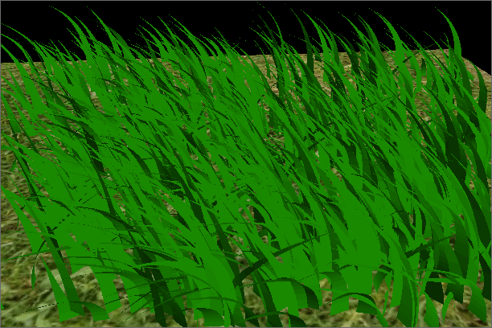
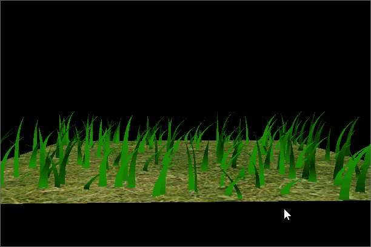
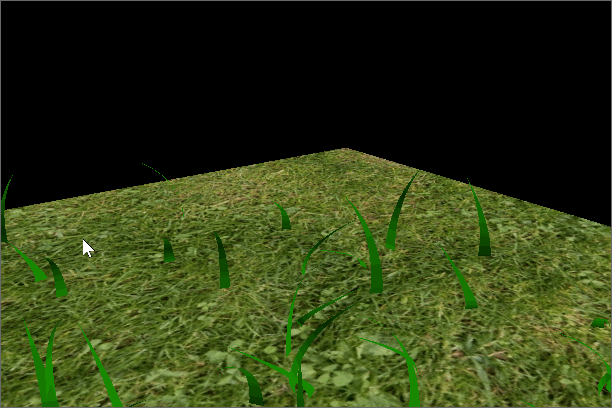
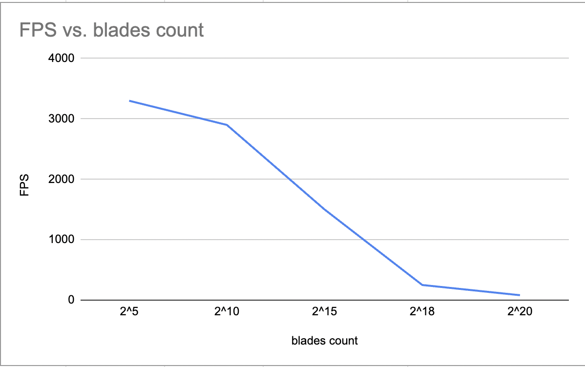

Vulkan Grass Rendering
==================================

**University of Pennsylvania, CIS 565: GPU Programming and Architecture, Project 5**

* Xiaoxiao Zou
  * [LinkedIn](https://www.linkedin.com/in/xiaoxiao-zou-23482a1b9/)
* Tested on: Windows 11, AMD Ryzen 9 7940HS @ 4.00 GHz, RTX 4060 Laptop 

### Result & Features

Features: 
- culling test
  - orientation culling test

    
    Orietation culling is based on if the view direction is not in the same direction as orientation, since the grass has no width, it will cause aliasing effect.

  - view frustum culling test

    

    view frustum culling is based on if the grass is inside camera view, if it is not, the grass will not be rendered.

  - distance culling test

    

    distance culling is based on if grass is too far away from the camera, if it is too far, it will not be rendered.

- physics simulation (no force shown below)

  
  - gravity force

    

    gravity force will be applied to the grass. since there is no other force be applied to grass, all of grass is laid down. 

  - recovery force (with gravity)

    

    with recovery force, the grass will be back to form a relatively steady position for the grass. 

  - wind force (with gravity and wind)
  
    

    with wind force, it will give grass a wind effect. I am using a wind force as sine function to get a effect to grass floating back and force. 

### Performance & Analysis

The FPS descreases as the blades counts become higher, especially when it reaches around 2^15. However, it roughly stays the same for low blades count (since threads count might be larger than blades count).

The FPS get increased for all culling method individually. (culling test on same view with same blade count). Distance culling gives better performance improvement for this certain view compared to the other twos. All together, it gives best performance improvement.
