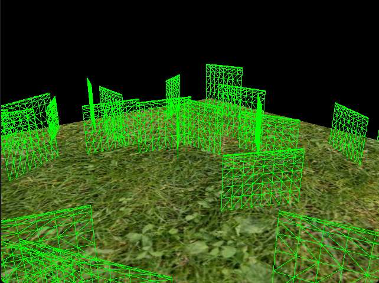
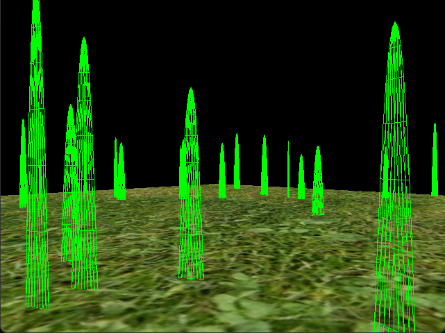
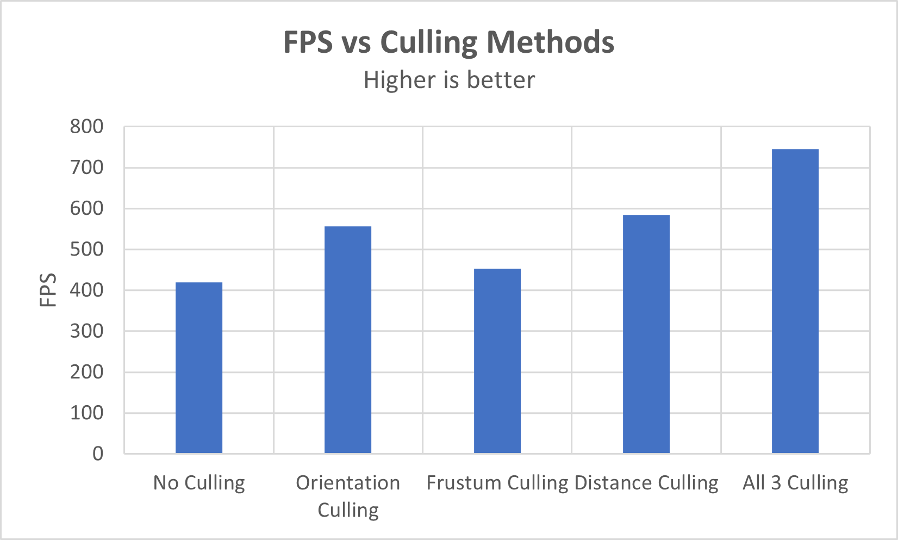
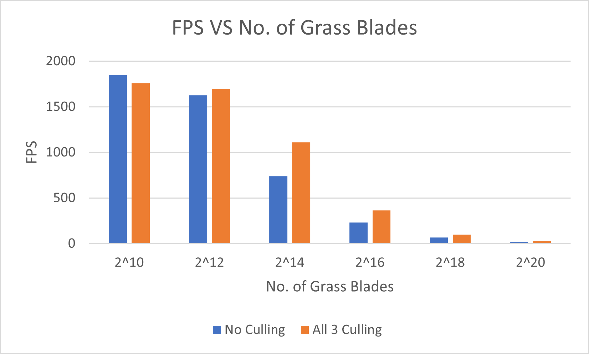
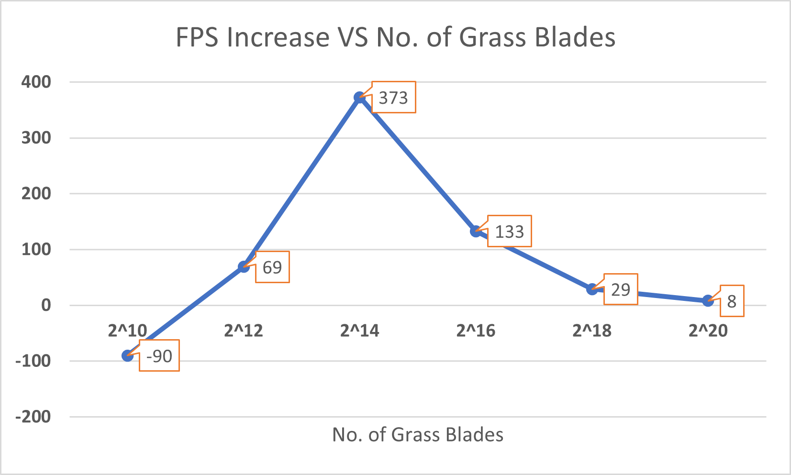

Vulkan Grass Rendering
==================================

**University of Pennsylvania, CIS 565: GPU Programming and Architecture, Project 3**

* Saksham Nagpal  
  * [LinkedIn](https://www.linkedin.com/in/nagpalsaksham/)
* Tested on: Windows 11 Home, AMD Ryzen 7 6800H Radeon @ 3.2GHz 16GB, NVIDIA GeForce RTX 3050 Ti Laptop GPU 4096MB

## Representative Outcome
|  |
|:--:|
| ***215 grass blades, tesselation level = 8*** |

## Summary
This Vulkan-based project is based on the paper [Responsive Real-Time Grass Grass Rendering for General 3D Scenes](https://www.cg.tuwien.ac.at/research/publications/2017/JAHRMANN-2017-RRTG/JAHRMANN-2017-RRTG-draft.pdf). The paper, and thus this project, utilizes the power of tesselation and compute shaders along with a physical model for the grass blades to allow real-time rendering of a large number of grass blades at interactive rates. [Rhuta Joshi](https://sites.google.com/view/rhuta-joshi), a 2023 graduate from the same Masters program as myself, did an excellent job in explaining the pipeline for the project:  

## The Physical Model
  

In this project, each grass blade is represented as a Bezier curve that is then used for performing physics calculations and culling operations.   
Each Bezier curve is defined by control points:
* `v0`: the position of the grass blade on the geomtry,
* `v1`: a Bezier curve guide that is always "above" `v0` with respect to the grass blade's up vector, and
* `v2`: a physical guide for simulating the forces on.

We also need to store per-blade characteristics that will help us simulate and tessellate our grass blades correctly.
* `up`: the blade's up vector, which corresponds to the normal of the geometry that the grass blade resides on at `v0`.
* Orientation: the orientation of the grass blade's face (shown as the angle *direction* in the reference image above taken from the paper).
* Height: the height of the grass blade.
* Width: the width of the grass blade's face.
* Stiffness coefficient: the stiffness of our grass blade.

The following 3 kinds of natural forces are considered to be acting upon each grass blade:
1. Gravity
2. Recovery
3. Wind

The compute shader `compute.comp` runs per-blade and is responsible to calculate the effect of all these forces on the blade and correspondigly set the positions of `v0`, `v1` and `v2` each frame. It is also responsible in performing culling operations which are discussed in a later section.

## Tesselation
Our tesselation pipeline is defined by the tesselation control shader `grass.tesc` and the tesselation evaluation shader `grass.tese`. This was my first time working with tesselation shaders, and it turned out to be a great learning experience! [Cem Yuksel's Explanation](https://www.youtube.com/watch?v=OqRMNrvu6TE) of tesselation shaders [this OGL dev tutorial](https://ogldev.org/www/tutorial30/tutorial30.html) were very helpful in cementing my understanding of tesselation shaders.

### Creating Geometry
Our tesselation control shader `grass.tesc` operates on single vertices, as instructed by the directive:  
`layout(vertices = 1) out;`  
On the other hand, our tesselation evaluation shader `grass.tese` expects quads to be generated for each 'input primitive' provided to the **Primitive Generator** by the control shader:  
`layout(quads, equal_spacing, ccw) in;`  
This means that for each input point from the control shader, the Primitive Generator generates quads which are tesselated according to the level defined by the control shader. Referring to some of the remapping functions mentioned in the paper, we are then able to remap the generated quad into a triangular shape to better match the shape of a leaf blade. 

|  |  |
|:--:|:--:|
| *Tesselated Quads generated per input primitive* | *Quads remapped to triangles to better represent grass leaves* |

### Level of Detail
Our tesselation pipeline is defined by the tesselation control shader `grass.tesc` and the tesselation evaluation shader `grass.tese`. This was my first time working with tesselation shaders, and as an opportunity to learn more about the power they are able to provide in terms of level of detail, I aimed to define the tesselation levels for each blade of the triangle based on the distance from the camera.  
  
As can be seen above, the tesselation level for a blade of triangle increases as it reaches closer to the camera.

## Rendering Optimizations - Culling
As explained in the paper, we perform 3 different types of culling to gain potential performance improvements:  
1. **Orientation Culling:** If a grass blade's forward vector is approximately perpendicular to the camera's view vector resulting in a very small width, we cull the grass blade. This feature can be toggled using the `ORIENTATION_CULLING` preprocessor directive in `compute.comp`.
2. **View-Frustum Culling:** This method culls the grass blades that lie outside our viewing frustum. This feature can be toggled using the `FRUSTUM_CULLING` preprocessor directive in `compute.comp`, and the tolerance value for the same can be set by choosing an appropriate value for the `tolerance` identifier in the compute shader.
3. **Distance Culling:** This method culls the grass blade that lie outside a certain threshold distance to avoid rendering costs for small grass blades as well as artifacts. This feature can be toggled using the `DISTANCE_CULLING` preprocessor directive in `compute.comp`.

|  |  |  |
|:--:|:--:|:--:|
| *Orientation Culling* | *View Frustum Culling* | *Distance Culling* |

## Performance Analysis
In this section, we first consider the effect of the various culling methods implemented and the corresponding FPS gains yielded by them, if any. Further, we compare the performance at varying number of grass blades and how it is affected by the culling methods.

### 1. Culling Methods

|  |
|:--:|
| *All tests performed for 215 grass blades, tesselation level = 8* |

For the considered blade count and geometry, orientation and distance culling seems to give a better FPS boost than frustum culling. In fact, frustum culling's performance is almost at-par with the no-culling test, with the minimal FPS boost probably being a result of the chosen camera angle such that some blades actually ended up getting culled. Had no blade been culled, frustum culling would've resulted in the same or perhaps poorer performance than having no culling at all. Finally, the best case scenario turns out to be when all 3 culling modes are enabled. This is expected as that scenario would result in the maximum number of blades getting culled.

### 2. Number of Grass Blades

|  |
|:--:|
| *All tests performed at tesselation level = 8* |

The above graph depicts the resultant FPS as the number of blades in the scene is varied. The overall decrease in FPS with increasing number of blades is expected. However, in each scenario, it is interesting to note the performance both with all 3 cuulling modes `ON` and `OFF`. The following plot highlights this difference better:

We see that as the number of blades in the scene increases, the culling scenario becomes more performant than having no culling in the scene. However this difference in gain is lower when there are fewer blades in the scene, with the no culling mode even being more performant than enabling all 3 culling mode when number of blades is 210. This is perhaps because there are very few blades in the scene, and mostly none of them get culled. Hence the cost of computations performed for the culling tests is not able to offset the cost of processing limited geometry in the scene.