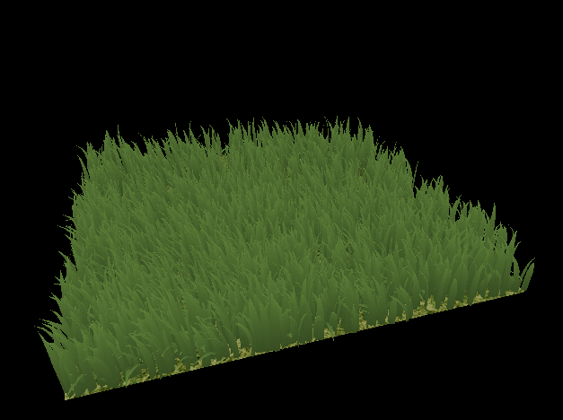
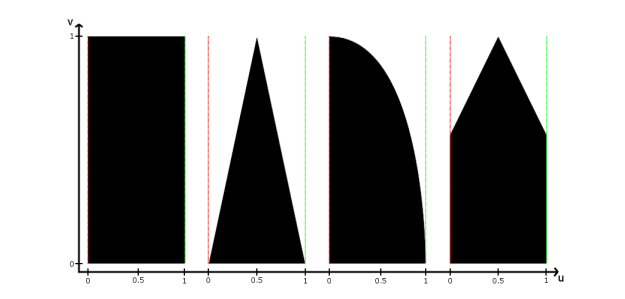
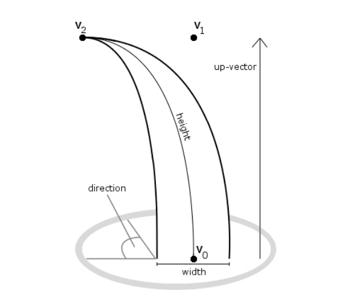
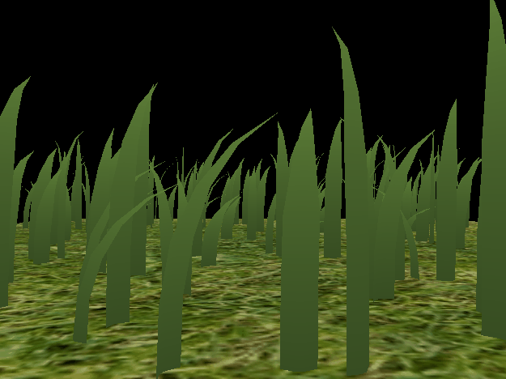
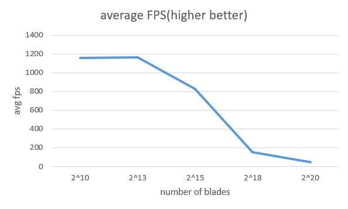
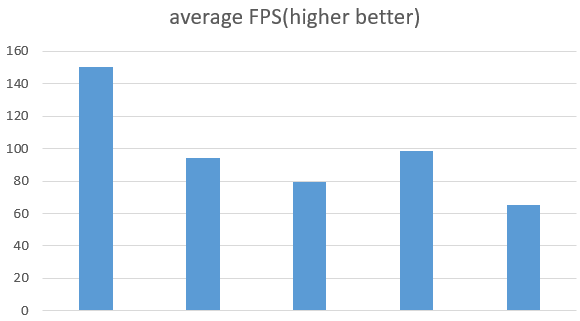

Vulkan Grass Rendering
==================================

**University of Pennsylvania, CIS 565: GPU Programming and Architecture, Project 5**

* Licheng CAO
  * [LinkedIn](https://www.linkedin.com/in/licheng-cao-6a523524b/)
* Tested on: Windows 10, i7-10870H @ 2.20GHz 32GB, GTX 3060 6009MB

Result
====
 * This project is implemented based on [Responsive Real-Time Grass Rendering for General 3D Scenes](https://www.cg.tuwien.ac.at/research/publications/2017/JAHRMANN-2017-RRTG/JAHRMANN-2017-RRTG-draft.pdf).

    

Features
===
### Blade Geometry
 * The [paper](https://www.cg.tuwien.ac.at/research/publications/2017/JAHRMANN-2017-RRTG/JAHRMANN-2017-RRTG-draft.pdf) presented 4 kinds of blade shapes as shown. I picked triangle-tip as my basic blade geometry.

    

### Force Simulation
 * In the [paper](https://www.cg.tuwien.ac.at/research/publications/2017/JAHRMANN-2017-RRTG/JAHRMANN-2017-RRTG-draft.pdf), The authors constructed a physical model to simulate grass, as depicted below. According to the paper, the parameters required to simulate grass include `v0`, `v1`, `v2`, `up`, `height`, `direction`, `width`, and `stiffness`. The first four values are of type `vec3`, while the subsequent values are simply of type `float`. In my implementation, I passed four `vec4` values to the shader, with the float value stored in `vec4.w`. This application simulates three types of forces: `gravity`, `wind force`, and `recover force`. The `recover force` characterizes the force that restores the grass blade to its equilibrium position and is computed using the parameter stiffness.
 

    

### Culling
* To enhance performance, the paper also introduced several culling methods aimed at eliminating unnecessary blades, thereby reducing the overall number of shapes that need to be rendered.

|Orientation Culling|Frustum Culling|Distance Culling|
|:--:|:--:|:--:|
||||

Performance
===
 * As expected, the average frames per second (FPS) decreases as the number of blades increases. However, as depicted in the figure, the FPS remains nearly constant when the number of blades is below 2^13, highlighting the efficiency of the algorithm.
  

    

* I recorded the average FPS with 2^18 blades, and the result is shown below. The average fps indicates that all culling methods offer some improvement for rendering. With my test scene, the distance culling contributes the most to fps, the reason might be that I picked a relatively small max distance for culling test, so that many blades are culled. Frustum culling gives the least improvement, this may due to the fact that I tried to record every blades in the output so most blades fall in the frustum and therefore are not culled.

|culling method applied|all cullings|orientation culling|frustum culling|distance culling|none|
|:--:|:--:|:--:|:--:|:--:|:--:|
|average fps(higher better)|150.5|94.1|79.7|98.4|65.3|
  

    

