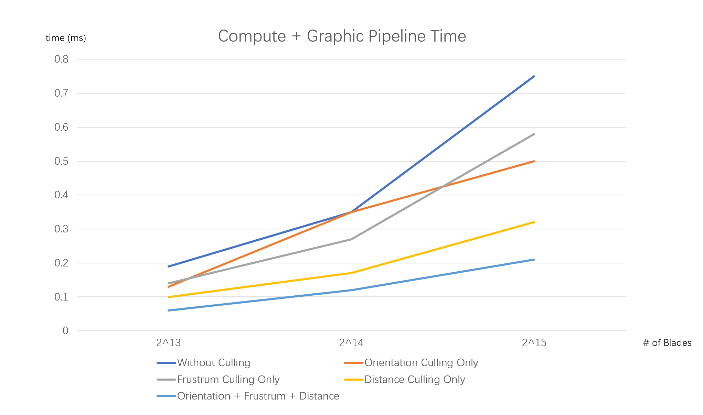

Vulkan Grass Rendering
=======================
In this project, I implemented a real-time Vulkan Grass Simulation based on this [paper](https://www.cg.tuwien.ac.at/research/publications/2017/JAHRMANN-2017-RRTG/JAHRMANN-2017-RRTG-draft.pdf).

**University of Pennsylvania, CIS 565: GPU Programming and Architecture, Project 5**

* Mengxuan Huang
  * [LinkedIn](https://www.linkedin.com/in/mengxuan-huang-52881624a/)
* Tested on: Windows 11, i9-13980HX @ 2.22GHz 64.0 GB, RTX4090-Laptop 16384MB
-----------------------------
## Overview

    

In this project, I used three control points($v_0, v_1, v_2$) and its $width$, $height$, and $direction$ to represent a grass.The control point $v_0$ act as the root of the grass and will not move during the simulation. All forces are applied on $v_2$. Control point $v_1$ is used to preserve the length of the grass. The result is shown in the gif below.

    

## Features
- Force Simulation
- Culling 

### Force Simulation
-------------------------------------------------
There are three kinds of forces applied to grass in the simulation:
- Gravity
- Recovery
- Wind

#### Gravity
The Gravity term includes the *environmental gravity* $g_E$ and the *front gravity* $g_F$, where
`gF = gF = (1/4) * ||gE|| * f`. And `f` if the vector perpendicular to the direction of grass.

#### Recovery
Recovery is used to represent the force the grass recover to the origin position, which is defined as `r = (v0 + up * height - v2) * stiffness`.

#### Wind
Wind can be any analytic functions that represent wind waves moving through 3D space. In my simulation, I used a combination of `sin` and `cos` functions: `windMagnitude = u * sin(v) - v * cos(u)`. Besides, total wind force `w = windMagnitude * windDirection * windAlignment`.

#### Total Force
Having the above foces, the total force `f = gE + gF + r + w`. Affter appling the total force to the control point $v_2$, it is also necessary to compute the position of $v_1$ and correct the position of $v_1$ and $v_2$ to preserve the length of grass.

### Culling
-------------------------------------------------
There are three kinds of culling used to improve the performance:
- Orienation Culling (cull grass that are align with view direction. )
- View Frustrum Culling (cull grass that are outside the view Frustrum. )
- Distance Culling (cull grass based on distance.)

## Performance Analysis
Test on 

    

As shown in the graph, with the increase of the number of grass, the compute + graphics pipline time increases. And the time drop significantly after culling blades before rendering. According to the graph, distance culling improve the performance most.   