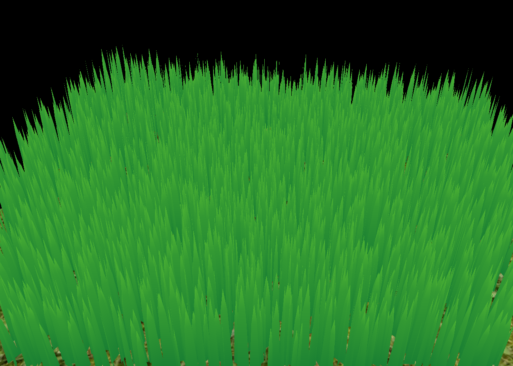
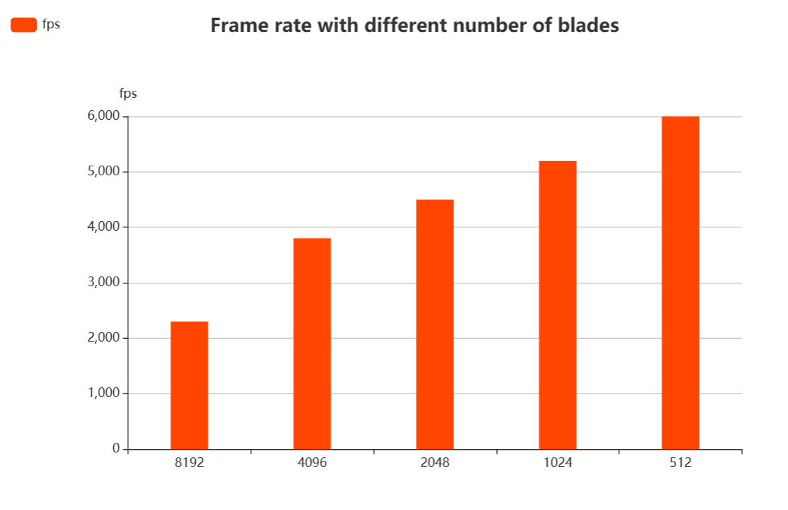
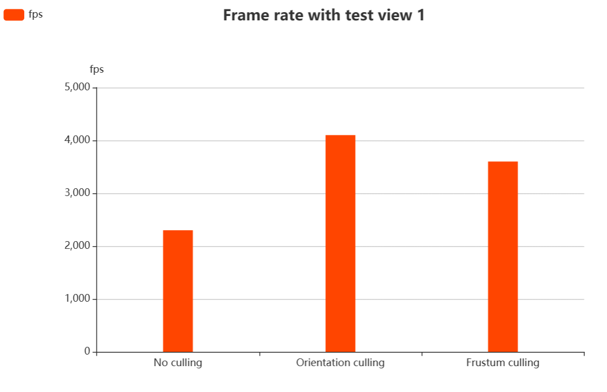
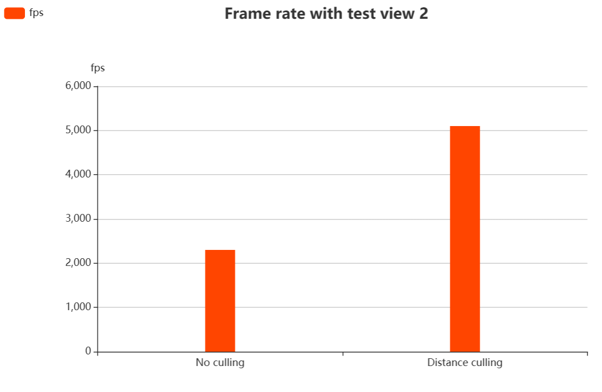

Vulkan Grass Rendering
==================================

**University of Pennsylvania, CIS 565: GPU Programming and Architecture, Project 5**

* Janet Wang [website](https://xchennnw.github.io/en.github.io/)
* Tested on: Windows 11, i7-12700H @ 2.30GHz 16GB, Nvidia Geforce RTX 3060 Ti  8054MB

### Summary
This project is a Vulkan grass simulator and renderer based on the paper [Responsive Real-Time Grass Rendering for General 3D Scenes](https://www.cg.tuwien.ac.at/research/publications/2017/JAHRMANN-2017-RRTG/JAHRMANN-2017-RRTG-draft.pdf).
It uses compute shaders to perform physics calculations on Bezier curves that represent individual grass blades in the application. It also uses compute shaders to cull grass blades that don't contribute to a given frame to improve efficiency. The remaining blades will be passed to a graphics pipeline, in which a vertex shader transforms Bezier control points, tessellation shaders dynamically creates the grass geometry from the Bezier curves, and a fragment shader shades the grass blades.

### Results
#### Grass without force.
 
 
#### Grass with gravity, recovery, and wind forces. 
 
 

#### Cullings
|  Orientation culling  | View-frustum culling | Distance culling | 
|---|---|---|
||||

### Performance Analysis
* Performance with different numbers of grass blades
  
  
* The improvement got by culling using each of the three culling tests
Test view 1 is chosen so that both orientation culling and view-frustum culling are working to cull some of the blades.
|  Test View 1 | Result |
|---|---|
|||
 

Test view 2 is chosen so that both distance culling is working to cull some of the blades.
|  Test View 2 | Result |
|---|---|
|||
