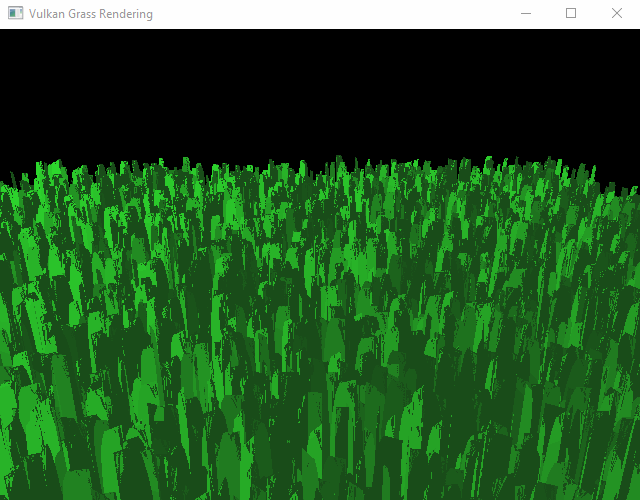
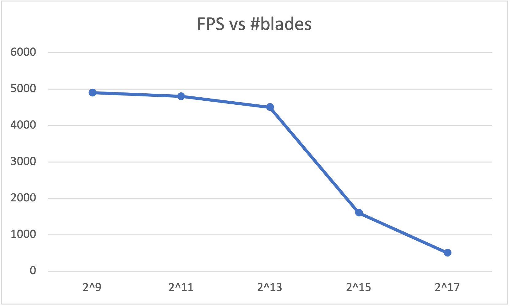
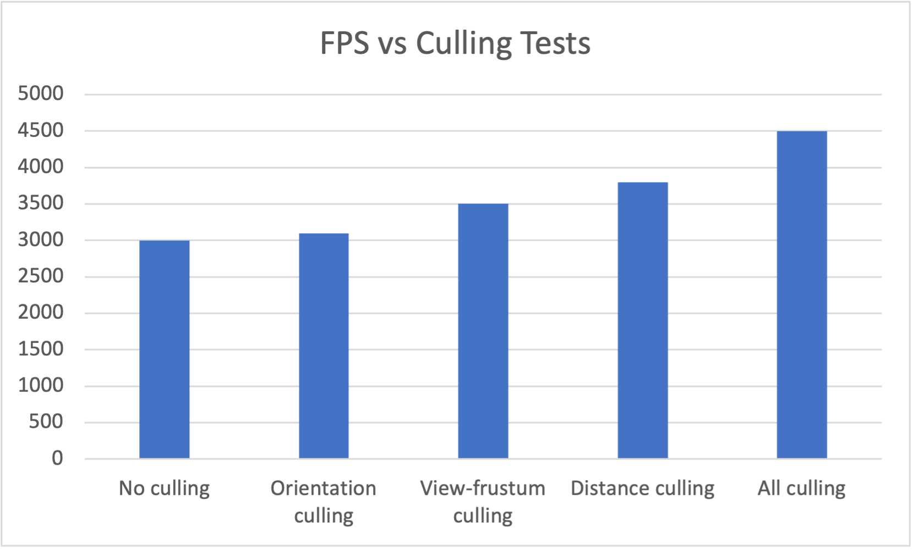

Vulkan Grass Rendering
==================================

**University of Pennsylvania, CIS 565: GPU Programming and Architecture, Project 5**

* Zhiyu Lei
  * [LinkedIn](https://www.linkedin.com/in/zhiyu-lei/), [Github](https://github.com/Zhiyu-Lei)
* Tested on: Windows 11, i7-7700K @ 4.20GHz 22GB, GeForce RTX 3070 Ti 222MB (SIG Lab)

### Project Description
This project is an implementation of the paper, [Responsive Real-Time Grass Rendering for General 3D Scenes](https://www.cg.tuwien.ac.at/research/publications/2017/JAHRMANN-2017-RRTG/JAHRMANN-2017-RRTG-draft.pdf).

#### Representing grass as Bezier curves
Grass blades are represented as Bezier curves with three control points (`v0`: positions on the ground `v0`, `v1`: guided positions above `v0`, `v2`: guided positions to simulate forces on), `up` vectors, orientations, heights, widths, and stiffness coefficients, in order to perform physics calculations, culling operations, and also to simulate and tessellate the grass bladed.

#### Simulating forces
Gravity (including environmental gravity and front gravity), recovery and wind (considering wind direction and wind alignment) simulations are implemented. These forces together determine what the grass blades will be like in the next time stamp. The table below shows the output after each force is added.
|Implementation|Output|
|:---:|:---:|
|No forces| All grass blades keep straight-up without movements|
|Gravity| All grass blades fall to ground in a moment
|Recovery| All grass blades bend down without movements
|Wind| All grass blades have some movements

#### Culling tests
Orientation culling, view-frustum culling and distance culling are implemented in order to cull blades that won't contribute positively to a given frame.

In orientation culling test, a grass blade is culled if its front face direction is almost perpendicular to the view vector, causing it to be smaller than the size of a pixel.

In view-frustum culling, a grass blade is culled if it is outside the view-frustum, causing it not to show up in the frame.

In distance culling, a grass blade is culled if it is far enough from the camera, causing it to be smaller than the size of a pixel.

#### Tessellating Bezier curves into grass blades
Each Bezier curve is passed in as a single patch to be processed by the grass graphics pipeline. The patch is then tessellated into the quadratic shape.

### Performance Analysis
#### The renderer handles varying numbers of grass blades
The plot below shows the average frame rate with respect to the number of grass blades. Obviously, larger grass blades number makes the computation and rendering slower.

#### The improvement by culling using each of the three culling tests
The chart below shows the average frame rate for each of the three culling tests applied, also with comparison to none of these applied and all of these applied. We can see using culling tests can improve the computation and rendering efficiency.

